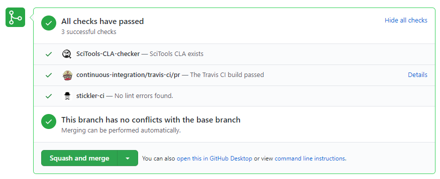

.. _developer_testing_ci:

.. include:: ../common_links.inc

Continuous Integration (CI) Testing
===================================

The `Iris`_ GitHub repository is configured to run checks on the code
automatically when a pull request is created, updated or merged against
Iris **master**.  The checks performed are:

* :ref:`testing_cla`
* :ref:`testing_travis`
* :ref:`testing_stickler`

.. _testing_cla:

SciTools CLA Checker
********************

A bot that checks the user who created the pull request has signed the
**Contributor's License Agreement (CLA)**.  For more information on this this
please see https://scitools.org.uk/organisation.html#governance

.. _testing_stickler:

Stickler CI
***********

Automatically enforces coding standards.  The configuration file named
`.stickler.yml`_ is in the Iris_ root directory.  For more information see
https://stickler-ci.com/.

.. _testing_travis:

Travis-CI
*********

The unit and integration tests in Iris are an essential mechanism to ensure
that the Iris code base is working as expected.  :ref:`developer_running_tests`
may be run manually but to ensure the checks are performed a
continuous integration testing tool named `travis-ci`_ is used.

A `travis-ci`_ configuration file named `.travis.yml`_
is in the Iris repository which tells travis-ci what commands to run.  The
commands include retrieving the Iris code base and associated test files using
conda and then running the tests.  `travis-ci`_ allows for a matrix of tests to
be performed to ensure that all expected variations test successfully.

The `travis-ci`_ tests are run automatically against the `Iris`_ master
repository when a pull request is submitted, updated or merged.

GitHub Checklist
****************

An example snapshot from a successful GitHub pull request shows all tests
passing:

If any CI checks fail, then the pull request is unlikely to be merged to the
Iris target branch by a core developer.

