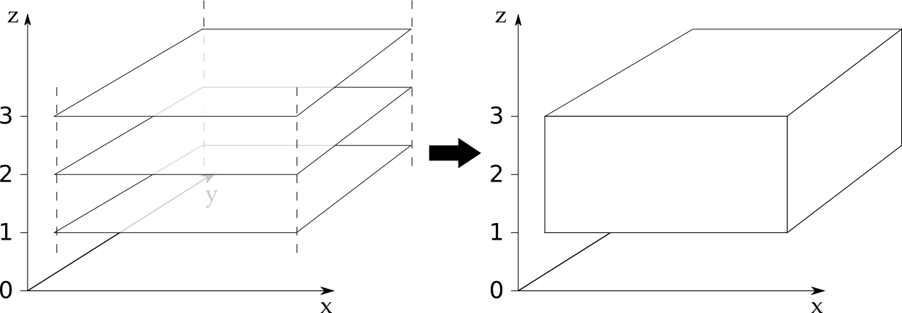
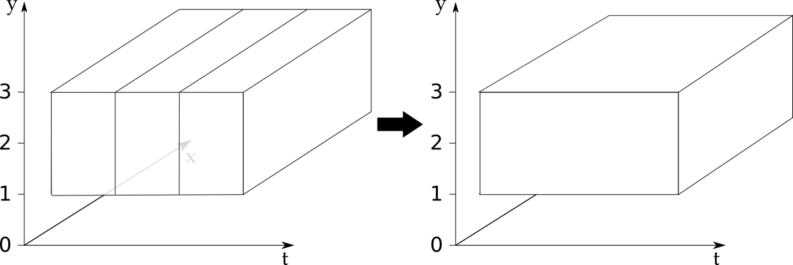

.. _merge_and_concat:

=====================
Merge and Concatenate
=====================

Sometimes you need to combine multiple Iris cubes to form a single larger Iris cube. You can achieve this with merge and concatenate.

This chapter of the user guide describes merge and concatenate.
It outlines use cases for merge and concatenate and describes the differences between them.
It also explains why some common issues occur and how to avoid these issues occurring.

The uses of merge and concatenate are as follows:

    * **Merge:** stacks the instances of a common scalar coordinate on each of a series of input cubes. This makes a resultant cube with a new dimension coordinate created by merging these scalar coordinates.
    * **Concatenate:** joins the instances of a common dimension coordinate from each of a series of input cubes. This makes a resultant cube with this dimension coordinate extended.

Merge
-----

:meth:`Merge <iris.cube.CubeList.merge>` stacks the instances of a common scalar coordinate on each of a series of input cubes.
This makes a resultant cube with a new dimension coordinate created by merging these scalar coordinates.
This has the following effects:

    * A new dimension coordinate is formed from the series of scalar coordinates from the input cubes. Its data is composed of the scalar coordinates' data values.
    * A single resultant cube is formed from the series of input cubes. It will have one more dimension (the new dimension coordinate described above) than the input cubes.

.. note::

    The data values in the series of scalar coordinates must describe a single monotonic series.

.. note::

    The order of the data values in the series of scalar coordinates does not affect the merge process.
    The data values in the series of scalar coordinates will be re-ordered into a montonically increasing series as part of the merge process.

.. warning::

    The shape, metadata, attributes, coordinates, coordinates metadata, fill value and other aspects of your input cubes must be consistent across all the input cubes.
    The merge process will fail if they are not consistent. Such failures are covered in the common issues section towards the end of this chapter.

Let's have a look at merge in operation. In this example we have three lateral (*x*, *y*) cubes in an :class:`cubelist <iris.cube.CubeList>`, each with a scalar *z* coordinate of differing value.
We can merge these cubes by stacking the scalar *z* coordinates to make a new *z* dimension coordinate::

    >>> print cubelist
    0: air_temperature / (kelvin)          (x: 10; y: 10)
    1: air_temperature / (kelvin)          (x: 10; y: 10)
    2: air_temperature / (kelvin)          (x: 10; y: 10)
    >>> print cubelist[0]
    air_temperature / (kelvin)          (x: 10; y: 10)
         Dimension coordinates:
              x                           x      -
              y                           -      x
         Scalar coordinates:
              z: 1
    print cubelist.merge()[0]  # Merge returns a cubelist.
    air_temperature / (kelvin)          (z: 3; x: 10; y: 10)
         Dimension coordinates:
              z                           x     -      -
              x                           -     x      -
              y                           -     -      x

Let's take a pictographic look at merge working:

We have cubes of identical shape and dimensions that stack nicely on the *z* axis.
This means we can take our three individual cubes and merge them into one new cube with a new *z* dimension coordinate.

Merge in Iris load
==================

Merge is used in the :func:`iris.load` process.
Using merge in the Iris load process means individual fields or messages read out of an input file are merged into cubes containing all the relevant data for each phenomenon present in the input file.

You can use :func:`iris.load_raw` to skip the merge step in the Iris load process.
This prevents the fields or messages in an input file being merged into cubes containing all the relevant data for each phenomenon present in the input file.

Using merge_cube
================

Iris contains two merge methods. These are merge, as described above; and :meth:`merge_cube <iris.cube.CubeList.merge_cube>`, which is described here.
The primary differences between merge and merge_cube are as follows:

    * **Number of returned cubes:**
      The primary purpose of merge_cube is to return either a single merged cube or raise a descriptive error explaining why a single merged cube is not possible.
      Note the difference to the behaviour of merge, which makes no check on the number of cubes returned.

    * **Action on failure:**
      If the merge_cube process fails (including there being more than one resultant cube) then an error will be raised that describes the problem preventing merge to a single cube.
      These error messages are designed to help you to diagnose the differences between the input cubes that prevent merge to a single cube.

To demonstrate the differences between merge and merge_cube, let's return to our three cubes from the earlier merge example.
For the purposes of this example we'll add a `Conventions` attribute to the first cube's :meth:`attributes <iris.cube.Cube.attributes>` dictionary.
This means the attributes dictionaries will not be consistent across our input cubes so our input cubes will not merge to a single cube::

    >>> print cubelist
    0: air_temperature / (kelvin)          (x: 10; y: 10)
    1: air_temperature / (kelvin)          (x: 10; y: 10)
    2: air_temperature / (kelvin)          (x: 10; y: 10)
    >>> print cubelist[0]
    air_temperature / (kelvin)          (x: 10; y: 10)
         Dimension coordinates:
              x                           x      -
              y                           -      x
         Scalar coordinates:
              z: 0
         Attributes:
              Conventions: CF-1.5
    >>> print cubelist.merge()
    0: air_temperature / (kelvin)          (x: 10; y: 10)
    1: air_temperature / (kelvin)          (z: 2; x: 10; y: 10)
    >>> print cubelist.merge_cube()
    Traceback (most recent call last):
        ...
        raise iris.exceptions.MergeError(msgs)
    iris.exceptions.MergeError: failed to merge into a single cube.
      cube.attributes keys differ: 'Conventions'

Note that merge returns two cubes here. All the cubes that can be merged have been and any that can't are returned unchanged in the cubelist returned by merge.
When merge_cube is called on this cubelist it raises a descriptive error that highlights the difference in the attributes dictionaries that is preventing merge.

Concatenate
-----------

:meth:`Concatenate <iris.cube.CubeList.concatenate>` joins the instances of a common dimension coordinate from each of a series of input cubes. This makes a resultant cube with this dimension coordinate extended.
This has the following effects:

    * An existing dimension coordinate is extended with the series of dimension coordinates from the input cubes.
    * A single resultant cube is formed from the series of input cubes. It will have the same number of dimensions as the input cubes, but the concatenated dimension coordinate will be extended.

.. note::

    The data values in the series of dimension coordinates must be able to be combined to describe a single monotonically increasing or decreasing series.

.. note::

    The order of the series of dimension coordinates will be re-ordered to form a monotonically increasing or decreasing series as part of the concatenate process.

.. warning::

    The shape, metadata, attributes, coordinates, coordinates metadata, fill value and other aspects of your input cubes must be consistent across all the input cubes.
    The concatenate process will fail if they are not consistent. Such failures are covered in the common issues section towards the end of this chapter.

Let's demonstrate concatenate in operation. In the example below we have three 3D (*x*, *y*, *t*) cubes whose `t` coordinates have sequentially increasing ranges.
These cubes can be concatenated by extending the `t` dimension of the first cube with the data from the other two cubes::

    >>> print cubelist
    0: air_temperature / (kelvin)          (t: 10; x: 10; y: 10)
    1: air_temperature / (kelvin)          (t: 10; x: 10; y: 10)
    2: air_temperature / (kelvin)          (t: 10; x: 10; y: 10)
    >>> print cubelist[0]
    air_temperature / (kelvin)          (t: 10; x: 10; y: 10)
         Dimension coordinates:
              t                           x      -      -
              x                           -      x      -
              y                           -      -      x
    >>> print cubelist.concatenate()[0]
    air_temperature / (kelvin)          (t: 30; x: 10; y: 10)
         Dimension coordinates:
              t                           x      -      -
              x                           -      x      -
              y                           -      -      x

Let's take a pictographic look at concatenate working:

As the `t` coordinates line up to make a sequence the three cubes can be concatenated by extending the `t` dimension coordinate of the first cube with the `t` dimension coordinates of the other two cubes.

Using concatenate_cube
======================

Iris contains two concatenate methods. These are concatenate, as described above; and :meth:`concatenate_cube <iris.cube.CubeList.concatenate_cube>`, which is described here.
The primary differences between concatenate and concatenate_cube are as follows:

    * **Number of returned cubes:**
      The primary purpose of concatenate_cube is to return either a single concatenated cube or raise a descriptive error explaining why a single concatenated cube is not possible.
      Note the difference to the behaviour of concatenate, which makes no check on the number of cubes returned.

    * **Action on failure:**
      If the concatenate_cube process fails (including there being more than one resultant cube) then an error will be raised that describes the problem preventing concatenation to a single cube.
      These error messages are designed to help you to diagnose the differences between the input cubes that prevent successful concatenation to a single cube.

To demonstrate the differences between concatenate and concatenate_cube, let's return to our three cubes from the earlier concatenate example.
For the purposes of this example we'll add a *History* attribute to the first cube's :meth:`attributes <iris.cube.Cube.attributes>` dictionary.
This means the attributes dictionaries will not be consistent across our input cubes so our input cubes will not concatenate to a single cube::

    >>> print cubelist
    0: air_temperature / (kelvin)          (t: 10; x: 10; y: 10)
    1: air_temperature / (kelvin)          (t: 10; x: 10; y: 10)
    2: air_temperature / (kelvin)          (t: 10; x: 10; y: 10)
    >>> print cubelist[0]
    air_temperature / (kelvin)          (t: 10; x: 10; y: 10)
         Dimension coordinates:
              t                           x      -      -
              x                           -      x      -
              y                           -      -      x
         Attributes:
              History: Created 2010-06-30         
    >>> print cubelist.concatenate()
    0: air_temperature / (kelvin)          (t: 10; x: 10; y: 10)
    1: air_temperature / (kelvin)          (t: 20; x: 10; y: 10)
    >>> print cubelist.concatenate_cube()
    Traceback (most recent call last):
        ...
        raise iris.exceptions.ConcatenateError(msgs)
    iris.exceptions.ConcatenateError: failed to concatenate into a single cube.
      Cube metadata differs for phenomenon: air_temperature

Note that concatenate returns two cubes here. All the cubes that can be concatenated have been and any that can't are returned unchanged in the cubelist returned by concatenate.
When concatenate_cube is called on this cubelist it raises a descriptive error highlighting that the difference is found in the metadata of a cube containing air temperature data.

Common issues with merge and concatenate
----------------------------------------

The Iris algorithms that drive merge and concatenate are complex and depend on a number of different elements of the input cubes being consistent across all input cubes.
If this consistency is not maintained then the merge or concatenate process can fail in a seemingly arbitrary manner.

The methods :meth:`merge_cube <iris.cube.CubeList.merge_cube>` and :meth:`concatenate_cube <iris.cube.CubeList.concatenate_cube>` 
were introduced to Iris to help you locate differences in input cubes that prevent the input cubes merging or concatenating.
Nevertheless, certain difficulties with using merge and concatenate occur frequently.
This section describes these common difficulties, why they arise and what you can do to avoid them.

Merge
=====

**Attributes Mismatch**

Differences in the :meth:`attributes <iris.cube.Cube.attributes>` (a cube's metadata, including coordinate metadata) of the input cubes probably cause the greatest amount of merge-related difficulties.
In recognition of this, Iris has a helper function, :func:`equalise_attributes <iris.experimental.equalise_cubes.equalise_attributes>`, to equalise attributes differences in the input cubes.

.. note::

    The functionality provided by :func:`iris.util.describe_diff` and :meth:`iris.cube.Cube.is_compatible` are **not** designed to give user indication of whether two cubes can be merged.

To demonstrate using `equalise_attributes`, let's return to our non-merging list of input cubes from the merge_cube example from earlier.
We'll call `equalise_attributes` on the input cubes before merging the input cubes using merge_cube::

    >>> from iris.experimental.equalise_cubes import equalise_attributes
    >>> print cubelist
    0: air_temperature / (kelvin)          (x: 10; y: 10)
    1: air_temperature / (kelvin)          (x: 10; y: 10)
    2: air_temperature / (kelvin)          (x: 10; y: 10)
    >>> print cubelist[0]
    air_temperature / (kelvin)          (x: 10; y: 10)
         Dimension coordinates:
              x                           x      -
              y                           -      x
         Scalar coordinates:
              z: 0
         Attributes:
              Conventions: CF-1.5
    >>> equalise_attributes(cubelist)
    >>> print cubelist.merge_cube()
    air_temperature / (kelvin)          (z: 3; x: 10; y: 10)
         Dimension coordinates:
              z                           x     -      -
              x                           -     x      -
              y                           -     -      x

.. warning::

    Do not delete a cube's attributes dictionary entirely!

**Incomplete Coordinates**

Merging input cubes with inconsistent dimension lengths can cause misleading results.
This is a common problem when merging cubes generated by different ensemble members in a model run.
The misleading results cause the merged cube to gain an anonymous leading dimension.
All the merged coordinates appear as auxiliary coordinates on the anonymous leading dimension.
This is shown in the example below::

    >>> print cube
    surface_temperature / (K)           (-- : 5494; latitude: 325; longitude: 432)
         Dimension coordinates:
              latitude                      -               x               -
              longitude                     -               -               x
         Auxiliary coordinates:
              forecast_month                x               -               -
              forecast_period               x               -               -
              forecast_reference_time       x               -               -
              realization                   x               -               -
              time                          x               -               -

**Merging Duplicate Cubes**

The Iris load process does not merge duplicate cubes (two or more identical cubes in the input cubes) by default.
This behaviour can be changed by setting the `unique` keyword argument to merge to `False`.

Merging duplicate cubes can cause misleading results. Let's demonstrate these behaviours and misleading results with the following example.
In this example we have three input cubes.
The first has a scalar `z` coordinate with value 1, the second has a scalar `z` coordinate with value 2 and the third has a scalar `z` coordinate with value 1.
The first and third cubes are thus identical.
We will demonstrate the effect of merging the input cubes with `unique=False` (duplicate cubes allowed) and `unique=True` (duplicate cubes not allowed)::

    >>> print cubelist
    0: air_temperature / (kelvin)          (x: 10; y: 10)
    1: air_temperature / (kelvin)          (x: 10; y: 10)
    2: air_temperature / (kelvin)          (x: 10; y: 10)
    >>> print cubelist.merge(unique=False)
    0: air_temperature / (kelvin)          (z: 2; x: 10; y: 10)
    1: air_temperature / (kelvin)          (z: 2; x: 10; y: 10)
    >>> print cubelist.merge()  # unique=True is the default.
    Traceback (most recent call last):
      ...
    iris.exceptions.DuplicateDataError: failed to merge into a single cube.
      Duplicate 'air_temperature' cube, with scalar coordinates z=Cell(point=1, bound=None)

Notice how merging the input cubes with duplicate cubes allowed produces a result with **four** `z` coordinate values.
Closer inspection of these two resultant cubes demonstrates that the scalar `z` coordinate with value 2 is found in both cubes.

Trying to merge the input cubes with duplicate cubes not allowed raises an error highlighting the presence of the duplicate cube.

**Scalar coordinates**

Scalar coordinates can cause confusion when merging or concatenating cubes.
This is because it is not necessarily clear whether merge or concatenate should be used to combine the input cubes.

.. note::

    The term *scalar coordinate* refers to any coordinate that contains only a single data value.
    This single data value can be a length-one vector.
    A scalar coordinate can also be a dimension coordinate on a cube if it is associated with one of the cube's dimensions.

Use merge to combine the input cubes and construct a new dimension if the scalar coordinate is not associated with one of the cube's dimensions (if it is not in the list of dimension coordinates).
Use concatenate to combine the input cubes if the scalar coordinate is associated with one of the cube's dimensions (if it is in the list of dimension coordinates).

Let's look at two example cubes to demonstrate this.

If your cubes are similar to the cube below (the scalar coordinate is not on a dimension) then you should use merge to combine your cubes::

    >>> print cube
    air_temperature / (kelvin)          (x: 10; y: 10)
         Dimension coordinates:
              x                           x      -
              y                           -      x
         Scalar coordinates:
              z: 0
    >>> print cube.shape
    (10, 10)

If your cubes are similar to the cube below (the scalar coordinate is on a dimension) then you should use concatenate to combine your cubes::

    >>> print cubes[0]
    air_temperature / (kelvin)          (z: 1; x: 10; y: 10)
         Dimension coordinates:
              z                           x     -      -
              x                           -     x      -
              y                           -     -      x
    >>> print cube.shape
    (1, 10, 10)

Concatenate
===========

**Time Units**

Differences in the units of the time coordinates of the input cubes probably cause the greatest amount of concatenate-related difficulties.
In recognition of this, Iris has a helper function, :func:`unify_time_units <iris.util.unify_time_units>`, to apply a common time unit to all the input cubes.

To demonstrate using `unify_time_units`, let's adapt our list of input cubes from the concatenate_cube example from earlier.
We'll give the input cubes unequal time coordinate units and call `unify_time_units` on the input cubes before concatenating the input cubes using concatenate_cube::

    >>> from iris.util import unify_time_units
    >>> print cubelist
    0: air_temperature / (kelvin)          (t: 10; x: 10; y: 10)
    1: air_temperature / (kelvin)          (t: 10; x: 10; y: 10)
    >>> print '{}\n{}'.format(cubelist[0].coord('t').units,
                              cubelist[1].coord('t').units)
    days since 1990-02-15
    days since 1970-01-01                              
    >>> print cubelist.concatenate_cube()
    Traceback (most recent call last):
      ...
    iris.exceptions.ConcatenateError: failed to concatenate into a single cube.
      Dimension coordinates metadata differ: t != t
    >>> unify_time_units(cubelist)
    >>> print cubelist.concatenate_cube()
    air_temperature / (kelvin)          (t: 20; x: 10; y: 10)
         Dimension coordinates:
              t                           x      -      -
              x                           -      x      -
              y                           -      -      x

**Attributes Mismatch**

Concatenate is affected by attributes mismatch on input cubes in the same way that merge is.
Please see the section "Attributes Mismatch" in the section on Merge above for further information on attributes mismatch.
