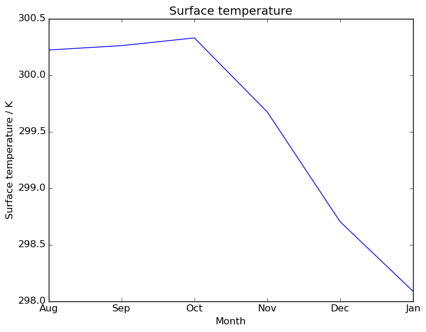

What's new in Iris 1.7
**********************

:Release: 1.7.0
:Date: XXX

Iris 1.7 features
=================

.. _showcase:

.. admonition:: Showcase: Biggus implementation in Iris

    Biggus supplies lazy array manipulation to Iris so that Iris can load and
    manipulate very large arrays without running out of memory. Manipulating very
    large arrays will still take a long time, but Biggus implementation ensures
    that such manipulation won't take a very long time that ends with a memory
    error.

    Note that on the surface nothing will appear to have changed, as Biggus lazy
    arrays are implemented in the underlying code.

    For example:

    .. code-block:: python

        >>> # Without Biggus:
        >>> result = extremely_large_cube.collapsed('time', iris.analyis.MEAN)
        Memory Error.
        >>> # With Biggus:
        >>> result = extremely_large_cube.collapsed('time', iris.analyis.MEAN)
        >>> print type(result)
        <class 'iris.cube.Cube'>

.. admonition:: Showcase: New interpolation and regridding API

    This release brings with it a new interface for accessing the interpolation and
    regridding capabilities within Iris. This replaces the old, clunky and
    exceedingly long-named interface with one that is much shorter, tidier, more
    unified, and hopefully simpler too.

    Currently linear regridding and interpolation is available via this new API,
    as well as area-weighted regridding.

    Let's compare old to new. The following two code snippets return exactly the
    same result but one is achieved with the old API and the other is achieved
    with the new.

    Linear interpolation:

    .. code-block:: python

        >>> # Old API:
        >>> interp_cube = iris.analysis.interpolate.linear(cube, sample_points)
        >>> # New API:
        >>> scheme = iris.analysis.Linear()
        >>> interp_cube = cube.interpolate(sample_points, scheme)

    Area-weighted regridding:

    .. code-block:: python

        >>> # Old API:
        >>> regridded_cube = iris.experimental.regrid.regrid_area_weighted_rectlinear_src_and_grid(cube, grid_cube)
        >>> # New API:
        >>> scheme = iris.analysis.AreaWeighted(mdtol=0.3)
        >>> regridded_cube = cube.regrid(grid_cube, scheme)

.. admonition:: Showcase: Cube math broadcasting (#1076)

    Cube math broadcasting enables mathematical operations between a cube and a resultant
    collapsed cube or slice of the cube without having to do any manual
    broadcasting/padding/stacking.

    For example:

    .. code-block:: python

        >>> import iris
        >>> import iris.tests.stock
        >>> cube = iris.tests.stock.realistic_4d()
        >>> avg_cube = cube.collapsed('model_level_number', iris.analysis.MEAN)
        >>> diff = cube - avg_cube

    Previously this would only work if the collapse/slice took place over the leftmost
    dimensions, through application of NumPy broadcasting rules.

    Addition, subtraction, multiplication and division are all supported.

* Make use of SciPy's RegularGridInterpolator for faster regridding.
* Allowed "no time averaging" as a column heading in NAME files.
* The NetCDF saver has been extended to allow saving of cubes with hybrid pressure
  auxiliary factories.
* PP/FF loading supports LBLEV of 9999.
* Extended GRIB1 loading to support data on hybrid pressure levels.
* :func:`iris.coord_categorisation.add_day_of_year` can be used to add categorised
  day of year coordinates based on time coordinates with non-Gregorian calendars.
* Support for loading data on reduced grids from GRIB files in raw form without
  automatically interpolating to a regular grid.
* The coordinate systems :class:`iris.coord_systems.Orthographic` and
  :class:`iris.coord_systems.VerticalPerspective` (for imagery from geostationary
  satellites) have been added.
* Extended NetCDF loading to support the "ocean sigma over z" auxiliary coordinate
  factory.
* Support added for loading CF-NetCDF data with bounds arrays that are missing a
  vertex dimension.
* :ref:`Reducing string auxiliary coordinates<strings>` using
  :meth:`iris.cube.Cube.rolling_window`, allowing for serialization of string coordinates.
* Loading of PP and FF files has been optimised through deferring creation of
  PPField attributes.
* Automatic association of a coordinate's CF formula terms variable with the
  data variable associated with that coordinate.
* PP loading translates cross-section height into a dimensional auxiliary coordinate.
* Translation of NAME metadata on height or altitude above ground or sea level
  into the relevant coordinate's long name.
* :ref:`String auxiliary coordinates may be plotted with Iris plotting wrappers<plotting>`.
* :func:`iris.analysis.geometry.geometry_area_weights` now allows for the calculation of
  normalized cell weights.
* Many new translations between the CF spec and STASH codes or GRIB2 parameter codes.
* PP save rules add the data's UM Version to the attributes of the  saved file
  when appropriate.
* NetCDF reference surface variable promotion available through the
  :class:`iris.FUTURE` mechanism.
* A speed improvement in calculation of :func:`iris.analysis.geometry.geometry_area_weights`.
* :ref:`Missing data tolerance (mdtol)<mdtol>` for area-weighted calculations allows
  for fractional tolerance of masked data to be specified.
* Handling for patching of the CF conventions global attribute via a defined
  cf_patch_conventions function.
* Concatenate reporting that raises a descriptive error if the concatenation
  process fails.

Hopefully included features
===========================

* Incorporation of Biggus deferred loading into the GRIB loader (#1137)

Bugs fixed
==========
* Data containing more than one reference cube for constructing hybrid height
  coordinates can now be loaded.
* Removed cause of increased margin of error when interpolating.
* Changed floating-point precision used when wrapping points for interpolation.
* Mappables that can be used to generate colorbars are now returned by Iris
  plotting wrappers.
* NetCDF load ignores over-specified formula terms on bounded dimensionless vertical
  coordinates.
* Auxiliary coordinate factory loading now correctly interprets formula term
  varibles for "atmosphere hybrid sigma pressure" coordinate data.
* Corrected comparison of NumPy NaN values in cube merge process.
* Fixes for :meth:`iris.Cube.intersection` to correct calculating the intersection
  of a cube with split bounds, handling of circular coordinates, and for finding
  a wrapped two-point result.

Incompatible changes
====================
* Saving a cube with a STASH attribute to NetCDF now produces a variable
  with an attribute of "um_stash_source" rather than "ukmo__um_stash_source".
* Cubes save to NetCDF with a coordinate system referencing a spherical ellipsoid
  now result in the grid mapping variable containing only the "earth_radius" attribute,
  rather than the "semi_major_axis" and "semi_minor_axis".
* Collapsing a cube over all of its dimensions now results in a scalar cube rather
  than a 1d cube.

Deprecations
============
* :func:`iris.util.ensure_array` has been deprecated.
* Matplotlib is no longer a core Iris dependency.

Documentation Changes
=====================
* A custom colours plotting example has been added.
* An example of reprojecting data and adding annotations has been added.
* A new section, whitepapers, has been added to the documentation. The first item
  added to this section contains a detailed overview of the PP/FF load process.

----

.. _strings:

Reducing string auxiliary coordinates
-------------------------------------
Auxiliary coordinates containing string data (for example coordinates generated
with :mod:`iris.coord_categorisation` functions) can now be collapsed in the same way
as coordinates containing more typical numerical data.

For example:

.. code-block:: python

    import iris
    import numpy as np

    cube = iris.cube.Cube(np.arange(6))
    sample_coord = iris.coords.DimCoord([0, 1, 2, 3, 4, 5], long_name='sample')
    month_coord = iris.coords.AuxCoord(['jan', 'feb', 'mar', 'apr', 'may', 'jun'],
                                       long_name='month')
    cube.add_dim_coord(sample_coord, 0)
    cube.add_aux_coord(month_coord, 0)

    aggregator = iris.analysis.MEAN
    smoothed = cube.rolling_window('sample', aggregator, 3)

.. _plotting:

Plotting string auxiliary coordinates
-------------------------------------
Auxiliary coordinates containing string data can also now be passed to Iris plotting
wrappers and used as the data to be plotted on an axis.

For example:

.. code-block:: python

    import matplotlib.pyplot as plt

    import iris
    from iris.coord_categorisation import add_month
    import iris.quickplot as qplt

    cube = iris.load_cube(iris.sample_data_path('GloSea4/ensemble_000.pp'))
    add_month(cube, cube.coord('time'))

    sub_cube = cube[:, 89, 102]
    qplt.plot(sub_cube.coord('month'), sub_cube)
    plt.savefig('plot_1d.png', bbox_inches='tight')
    plt.show()

.. _mdtol:

Missing data tolerance for area-weighted calculations
-----------------------------------------------------
Missing data tolerance (mdtol) describes the fractional tolerance for missing
data within any given grid cell in a regridding operation. Thus if the fraction
of missing data (from overlapping source grid cells) in a grid cell exceeds the
value of mdtol then the grid cell will be masked.

By extension, an mdtol of 0 means no missing data is tolerated while an mdtol of 1
means that grid cells will only be masked if all contributing elements from the
source grid are masked.
