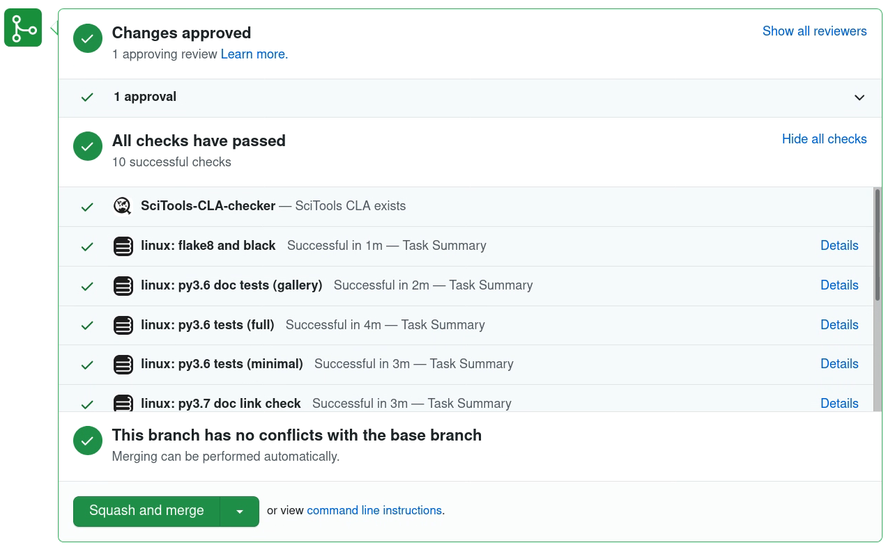

.. include:: ../common_links.inc

.. _developer_testing_ci:

Continuous Integration (CI) Testing
===================================

.. note:: Iris is currently supported and tested against |python_support|
          running on Linux.  We do not currently actively test on other
          platforms such as Windows or macOS.

The `Iris`_ GitHub repository is configured to run checks against all its
branches automatically whenever a pull-request is created, updated or merged.
The checks performed are:

* :ref:`testing_gha`
* :ref:`testing_cla`
* :ref:`pre_commit_ci`

.. _testing_gha:

GitHub Actions
**************

Iris unit and integration tests are an essential mechanism to ensure
that the Iris code base is working as expected.  :ref:`developer_running_tests`
may be performed manually by a developer locally. However Iris is configured to
use `GitHub Actions`_ (GHA) for automated Continuous Integration (CI) testing.

The Iris GHA YAML configuration files in the ``.github/workflows`` directory
defines the CI tasks to be performed. For further details
refer to the `GitHub Actions`_ documentation. The tasks performed during CI include:

* running the system, integration and unit tests for Iris
* ensuring the documentation gallery builds successfully
* performing all doc-tests within the code base
* checking all URL references within the code base and documentation are valid

The above GHA tasks are run automatically against all `Iris`_ branches
on GitHub whenever a pull-request is submitted, updated or merged. See the
`Iris GitHub Actions`_ dashboard for details of recent past and active CI jobs.

.. _gha_test_env:

GitHub Actions Test Environment
-------------------------------

The CI test environments for our GHA is determined from the requirement files
in ``requirements/pyXX.yml``.  These are conda environment files list the top-level
package dependencies for running and testing Iris.

For reproducible test results, these environments are resolved for all their dependencies
and stored as conda lock files in the ``requirements/locks`` directory.  The test environments
will not resolve the dependencies each time, instead they will use the lock files to reproduce the
exact same environment each time.

**If you have updated the requirement YAML files with new dependencies, you will need to
generate new lock files.** To do this, run the command::

   python tools/update_lockfiles.py -o requirements/locks requirements/py*.yml

or simply::

   make lockfiles

and add the changed lockfiles to your pull request.

New lockfiles are generated automatically each week to ensure that Iris continues to be
tested against the latest available version of its dependencies.
Each week the yaml files in ``requirements`` are resolved by a GitHub Action.
If the resolved environment has changed, a pull request is created with the new lock files.
The CI test suite will run on this pull request. If the tests fail, a developer
will need to create a new branch based off the ``auto-update-lockfiles`` branch
and add the required fixes to this new branch. If the fixes are made to the
``auto-update-lockfiles`` branch these will be overwritten the next time the
Github Action is run.

GitHub Checklist
----------------

An example snapshot from a successful GitHub pull-request shows all tests
passing:

If any CI tasks fail, then the pull-request is unlikely to be merged to the
Iris target branch by a core developer.

.. _testing_cla:

`CLA Assistant`_
****************

A bot which checks that the GitHub authors of the pull-request have signed the
|SciTools Contributor's License Agreement (CLA)|_.

.. _pre_commit_ci:

pre-commit CI
*************

A CI service for the `pre-commit`_ framework that checks and auto fixes all
pull-requests given the `Iris`_ GitHub repository `.pre-commit-config.yaml`_.

See the `pre-commit.ci dashboard`_ for details of recent past and active Iris jobs.

.. note::

  The `codespell`_ ``pre-commit`` hook checks the spelling of the whole codebase
  and documentation.  This hook is configured in the ``[tool.codespell]`` section
  of the ``pyproject.toml`` file.

  Append to the ``ignore-words-list`` option any **valid words** that are
  considered **not** a typo and should **not** be corrected by `codespell`_.

ruff
----
As of **Iris 3.8** `ruff`_ has been adopted to ensure our codebase is using best
practice.  `ruff`_ is configured in the `Iris`_ GitHub repository using  
`.pre-commit-config.yaml`_.  

You can install and run `ruff`_ in your development **iris-dev** conda environment
via::

   conda activate iris-dev
   pip install ruff
   cd iris
   ruff .

.. note::

  The `ruff`_ ``pre-commit`` hook checks for compliance of the whole codebase.
  This hook is configured in the ``[tool.ruff]`` section
  of the ``pyproject.toml`` file.

  Edit the ``.ruff.toml`` file to include any *temporary* rules to be ignored. Edit the ``pyproject.toml`` to include any *permanent* rules to be ignored. We
  aim to be fully `ruff`_ compliant as possible.

For more information on how to use `ruff`_ please see the `ruff documentation`_.

.. _.pre-commit-config.yaml: https://github.com/SciTools/iris/blob/main/.pre-commit-config.yaml
.. _pre-commit.ci dashboard: https://results.pre-commit.ci/repo/github/5312648
.. _CLA Assistant: https://github.com/cla-assistant/cla-assistant
.. |SciTools Contributor's License Agreement (CLA)| replace:: **SciTools Contributor's License Agreement (CLA)**
.. _ruff documentation: https://docs.astral.sh/ruff/tutorial/
