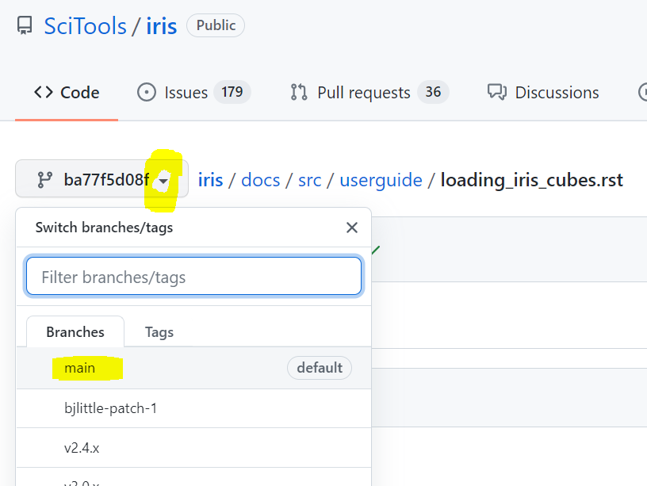
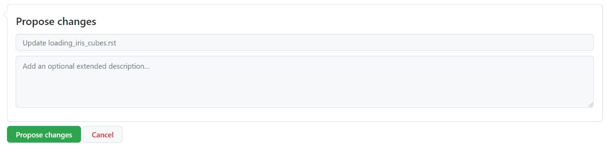
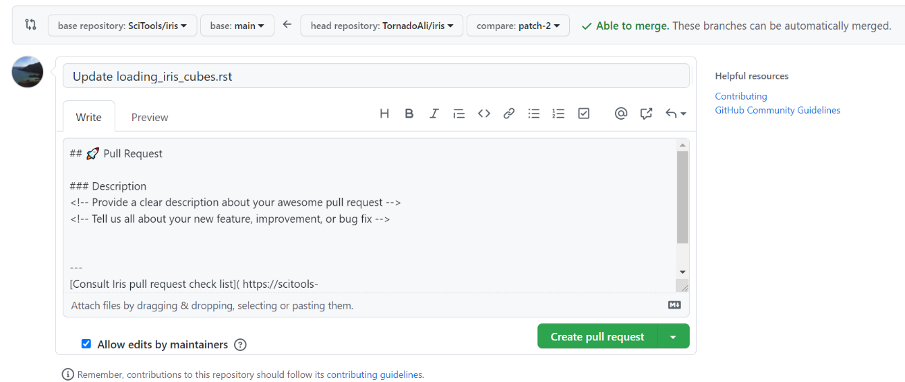

.. include:: ../common_links.inc

.. _contributing.documentation_easy:

Contributing to the Documentation (the easy way)
------------------------------------------------

Documentation is important and we encourage any improvements that can be made.
If you believe the documentation is not clear please contribute a change to
improve the documentation for all users.

The guide below is designed to be accessible to those with little-to-no
knowledge of programming and GitHub. If you find that something doesn't work as
described or could use more explanation then please let us know (or contribute
the improvement yourself)!

First Time Only Steps
^^^^^^^^^^^^^^^^^^^^^

1. Create a `GitHub <https://github.com/>`_ account.

2. Complete the `SciTools Contributor's License Agreement (CLA)`_.
   This is a one-off requirement for anyone who wishes to contribute to a
   Scitools repository - including the documentation.

Steps to Complete Each Time You Propose Changes
^^^^^^^^^^^^^^^^^^^^^^^^^^^^^^^^^^^^^^^^^^^^^^^

1. Navigate to the documentation page that you want to edit (on this site).

2. Click the ``Edit on GitHub`` button at the **top right** of the page.

.. image:: edit_on_github.png

3. In the resulting GitHub page select **main** from the ``Switch
   branches/tags`` drop-down menu near the **top left** of the page (to the left
   of the ``iris / docs / src / ...`` links) if it isn't already. This changes
   the branch to **main**.

4. Click the pencil symbol near the **top right** (to the right of the ``Raw``
   and ``Blame`` buttons).

.. image:: edit_button.png

5. Make your edits! Try to strike a balance between informing the audience
   enough that they understand and overwhelming them with information.

.. note::

    You may see the following message at the top of the edit page, informing you
    that GitHub has created you your own ``fork`` (or copy) of the project as a
    precursor to allowing you to edit the page. Your changes will be merged into
    the main version of the documentation later.

    .. image:: fork_banner.png

6. Scroll to the bottom of the edit page and enter some appropriate information
   in the two boxes under ``Propose changes``. You can just keep the default text
   if you like or enter something more specific - a short sentence explaining
   what's changed is fine. Then click the ``Propose changes`` button.

7. In the resulting page titled ``Pull Request``, write a brief description of
   what you've changed underneath the following three lines:

.. code::

    ### Description
    <!-- Provide a clear description about your awesome pull request -->
    <!-- Tell us all about your new feature, improvement, or bug fix -->

Describing what you've changed and why will help the person who reviews your changes.

8.	Click the ``Create pull request`` button.

.. tip::

   If you're not sure that you're making your pull request right, or have a
   question, then make it anyway! You can then comment on it to ask your
   question, then someone from the dev team will be happy to help you out (then
   edit your pull request if you need to).

What Happens Next?
^^^^^^^^^^^^^^^^^^

Another Iris contributor will review your changes (this happens for everyone who
makes changes to Iris or its documentation). The reviewer might make comments or
ask questions (don't worry about missing these, GitHub will email you to let you
know). You can respond to these comments underneath where they appear in GitHub.

Once you've worked everything out together, the reviewer will merge your changes
into the main version of the documentation so that they're accessible for
everyone to benefit from.

**You've now contributed to the Iris documentation!** If you've caught the bug
and want to get more involved (or you're just interested what that would mean)
then chat to the person reviewing your code or another Iris contributor.