.. include:: ../common_links.inc

Token GitHub App
----------------

.. note::

   This section of the documentation is applicable only to GitHub `SciTools`_
   Organisation **owners** and **administrators**.

.. note::

   The ``iris-actions`` GitHub App has been rebranded with the more generic
   name ``scitools-ci``, as the app can be used for any `SciTools`_ repository,
   not just ``iris`` specifically.

   All of the following instructions are still applicable.

This section describes how to create, configure, install and use our `SciTools`_
GitHub App for generating tokens for use with *GitHub Actions* (GHA).

Background
^^^^^^^^^^

Our GitHub *Continuous Integration* (CI) workflows require fully reproducible
`conda`_ environments to test ``iris`` and build our documentation.

The ``iris`` `refresh-lockfiles`_ GHA workflow uses the `conda-lock`_ package to routinely
generate a platform specific ``lockfile`` containing all the package dependencies
required by ``iris`` for a specific version of ``python``.

The environment lockfiles created by the `refresh-lockfiles`_ GHA are contributed
back to ``iris`` though a pull-request that is automatically generated using the
third-party `create-pull-request`_ GHA.  By default, pull-requests created by such an
action using the standard ``GITHUB_TOKEN`` **cannot** trigger other workflows, such
as our CI.

As a result, we use a dedicated authentication **GitHub App** to securely generate tokens
for the `create-pull-request`_ GHA, which then permits our full suite of CI testing workflows
to be triggered against the lockfiles pull-request.  Ensuring that the CI is triggered gives us
confidence that the proposed new lockfiles have not introduced a package level incompatibility
or issue within ``iris``. See :ref:`use gha`.

Create GitHub App
^^^^^^^^^^^^^^^^^

The **GitHub App** is created for the sole purpose of generating tokens for use with actions,
and **must** be owned by the `SciTools`_ organisation.

To create a minimal `GitHub App`_ for this purpose, perform the following steps:

1. Click the `SciTools`_ organisation ``⚙️ Settings`` option.

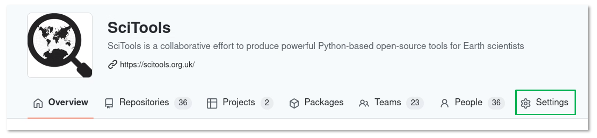

2. Click the ``GitHub Apps`` option from the ``<> Developer settings``
   section in the left hand sidebar.

..  figure:: assets/developer-settings-github-apps.png
    :alt: Developer settings, GitHub Apps option
    :align: center
    :width: 25%

3. Now click the ``New GitHub App`` button to display the ``Register new GitHub App``
   form.

Within the ``Register new GitHub App`` form, complete the following fields:

4. Set the **mandatory** ``GitHub App name`` field to be ``iris-actions``.
5. Set the **mandatory** ``Homepage URL`` field to be ``https://github.com/SciTools/iris``
6. Under the ``Webhook`` section, **uncheck** the ``Active`` checkbox.
   Note that, **no** ``Webhook URL`` is required.

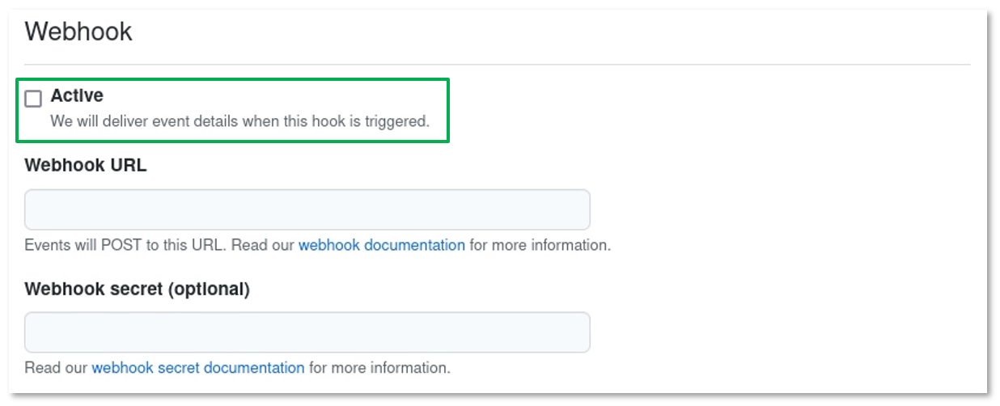

7. Under the ``Repository permissions`` section, set the ``Contents`` field to
   be ``Access: Read and write``.

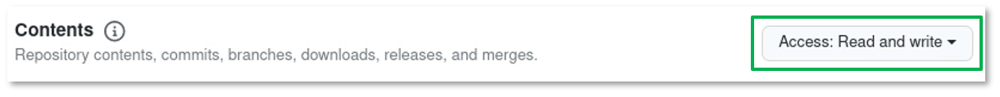

8. Under the ``Repository permissions`` section, set the ``Pull requests`` field
   to be ``Access: Read and write``.

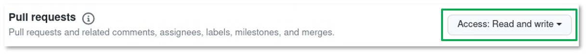

9. Under the ``Organization permissions`` section, set the ``Members`` field to
   be ``Access: Read-only``.

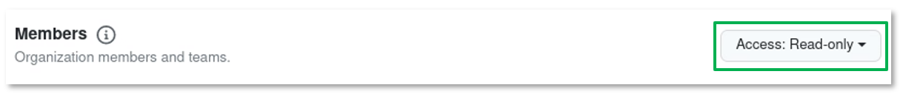

10. Under the ``User permissions`` section, for the ``Where can this GitHub App be installed?``
    field, **check** the ``Only on this account`` radio-button i.e., only allow
    this GitHub App to be installed on the **SciTools** account.

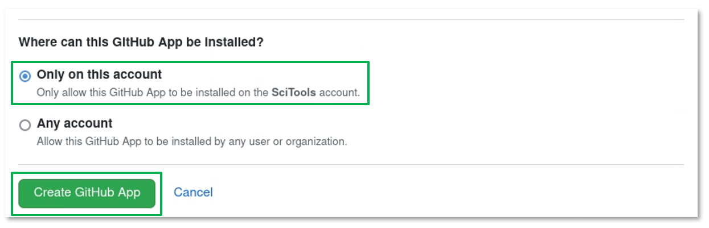

11. Finally, click the ``Create GitHub App`` button.

Configure GitHub App
^^^^^^^^^^^^^^^^^^^^

Creating the GitHub App will automatically redirect you to the ``SciTools settings / iris-actions``
form for the newly created app.

Perform the following GitHub App configuration steps:

.. _app id:

1. Under the ``About`` section, note of the GitHub ``App ID`` as this value is
   required later.  See :ref:`gha secrets`.
2. Under the ``Display information`` section, optionally upload the ``iris`` logo
   as a ``png`` image.
3. Under the ``Private keys`` section, click the ``Generate a private key`` button.

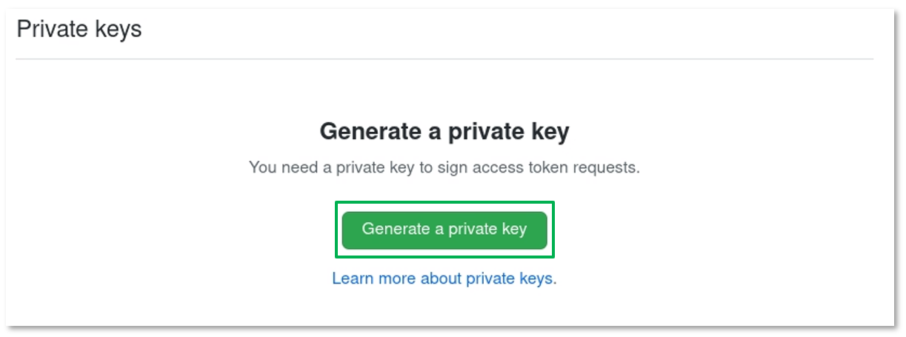

.. _private key:

GitHub will automatically generate a private key to sign access token requests
for the app.  Also a separate browser pop-up window will appear with the GitHub
App private key in ``OpenSSL PEM`` format.

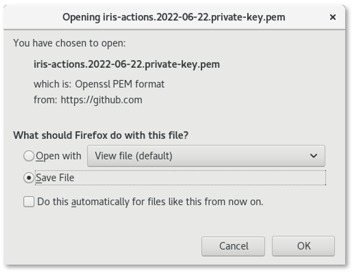

.. important::

   Please ensure that you save the ``OpenSSL PEM`` file and **securely** archive
   its contents.  The private key within this file is required later.
   See :ref:`gha secrets`.

Install GitHub App
^^^^^^^^^^^^^^^^^^

To install the GitHub App:

1. Select the ``Install App`` option from the top left menu of the
   ``Scitools settings / iris-actions`` form, then click the ``Install`` button.

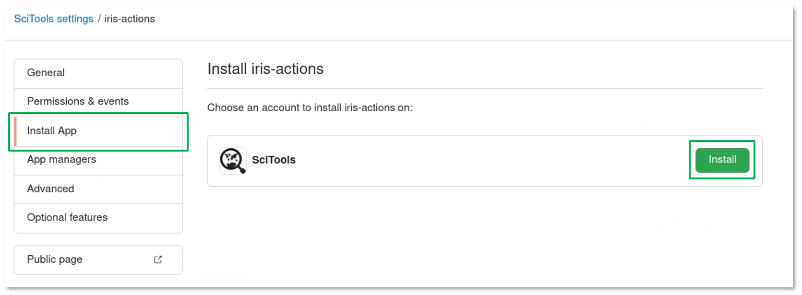

2. Select the ``Only select repositories`` radio-button from the ``Install iris-actions``
   form, and choose the ``SciTools/iris`` repository.

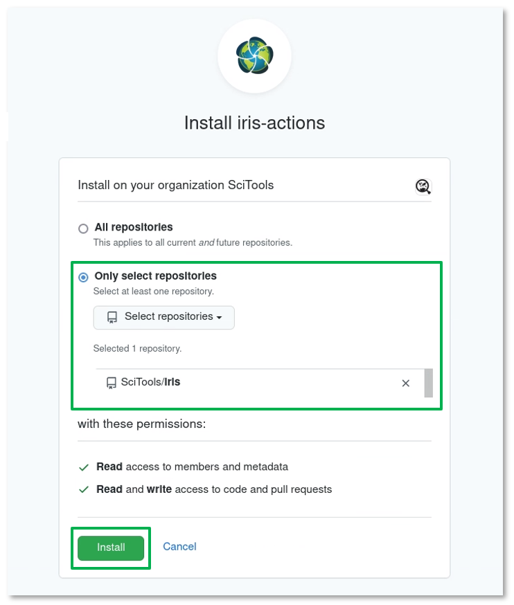

3. Click the ``Install`` button.

   The successfully installed ``iris-actions`` GitHub App is now available under
   the ``GitHub Apps`` option in the ``Integrations`` section of the `SciTools`_
   organisation ``Settings``.  Note that, to reconfigure the installed app click
   the ``⚙️ App settings`` option.

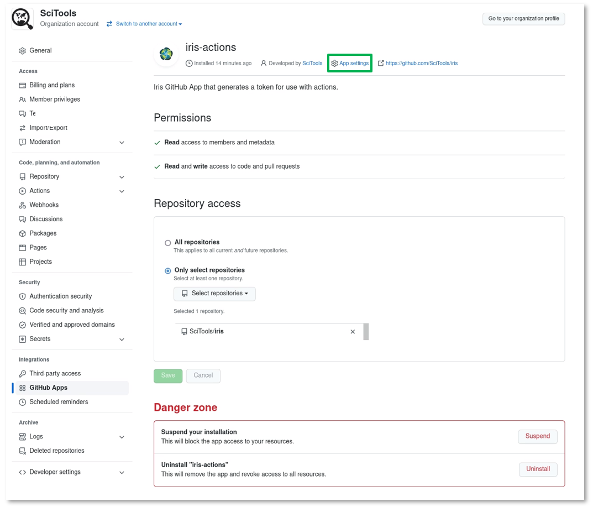

4. Finally, confirm that the ``iris-actions`` GitHub App is now available within
   the `SciTools/iris`_ repository by clicking the ``GitHub apps`` option in the
   ``⚙️ Settings`` section.

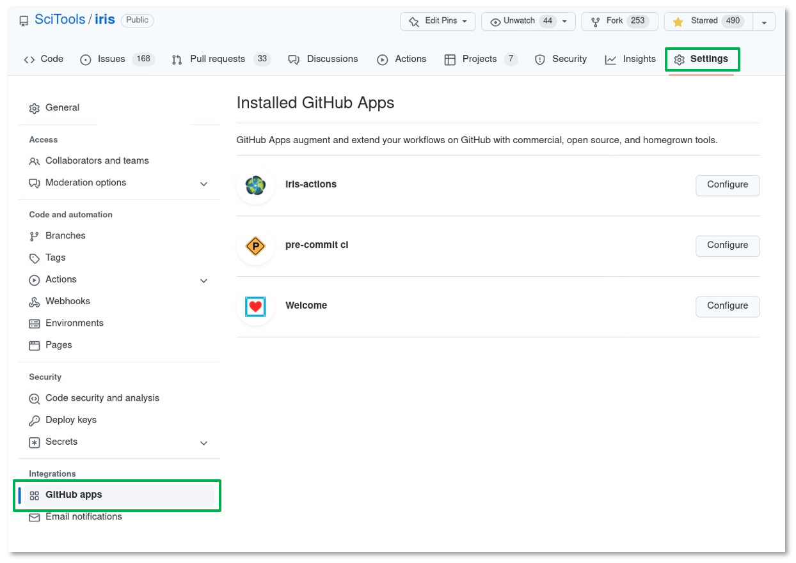

.. _gha secrets:

Create Repository Secrets
^^^^^^^^^^^^^^^^^^^^^^^^^

The GitHub Action that requests an access token from the ``iris-actions``
GitHub App must be configured with the following information:

* the ``App ID``, and
* the ``OpenSSL PEM`` private key

associated with the ``iris-actions`` GitHub App.  This **sensitive** information is
made **securely** available by creating `SciTools/iris`_ repository secrets:

1. Click the `SciTools/iris`_ repository ``⚙️ Settings`` option.

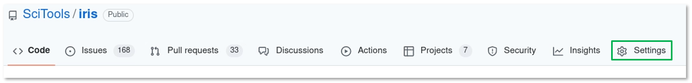

2. Click the ``Actions`` option from the ``Security`` section in the left hand
   sidebar.

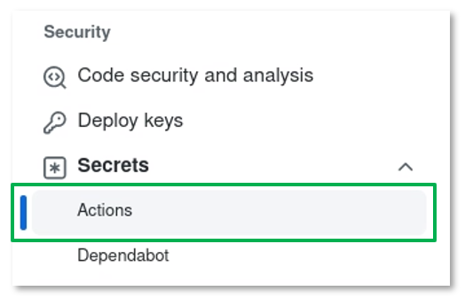

3. Click the ``New repository secret`` button.

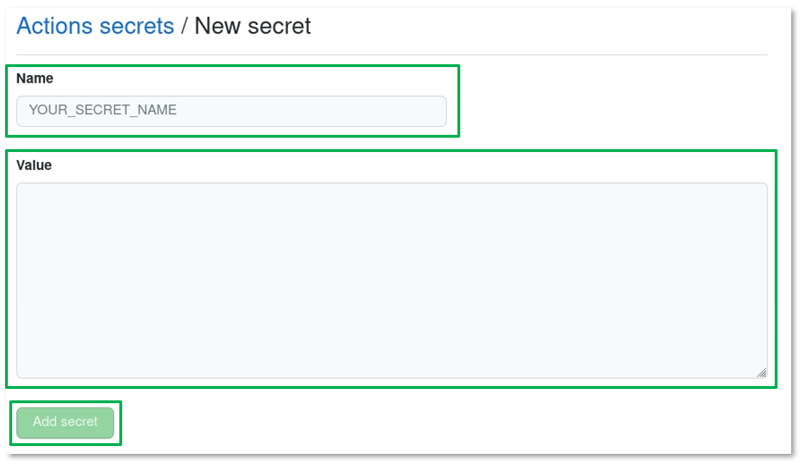

4. Complete the ``Actions secrets / New secret`` form for the ``App ID``:

   * Set the ``Name`` field to be ``AUTH_APP_ID``.
   * Set the ``Value`` field to be the numerical ``iris-actions`` GitHub ``App ID``.
     See :ref:`here <app id>`.
   * Click the ``Add secret`` button.

5. Click the ``New repository secret`` button again, and complete the form
   for the ``OpenSSL PEM``:

   * Set the ``Name`` field to be ``AUTH_APP_PRIVATE_KEY``.
   * Set the ``Value`` field to be the entire contents of the ``OpenSSL PEM`` file.
     See :ref:`here <private key>`.
   * Click the ``Add secret`` button.

A summary of the newly created `SciTools/iris`_ repository secrets is now available:

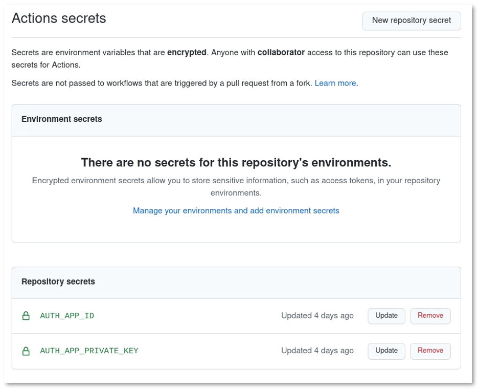

.. _use gha:

Use GitHub App
^^^^^^^^^^^^^^

The following example workflow shows how to use the `github-app-token`_ GHA
to generate a token for use with the `create-pull-request`_ GHA:

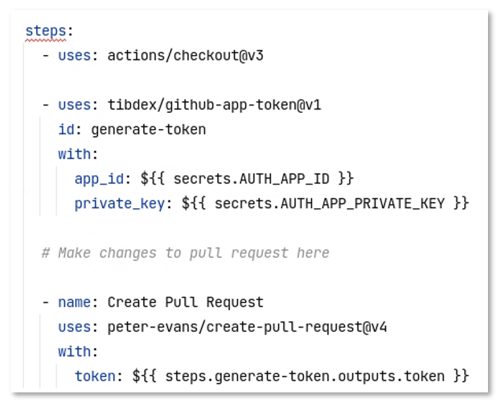

.. _GitHub App: https://docs.github.com/en/developers/apps/building-github-apps/creating-a-github-app
.. _SciTools/iris: https://github.com/SciTools/iris
.. _conda-lock: https://github.com/conda-incubator/conda-lock
.. _create-pull-request: https://github.com/peter-evans/create-pull-request
.. _github-app-token: https://github.com/tibdex/github-app-token
.. _refresh-lockfiles: https://github.com/SciTools/iris/blob/main/.github/workflows/refresh-lockfiles.yml
