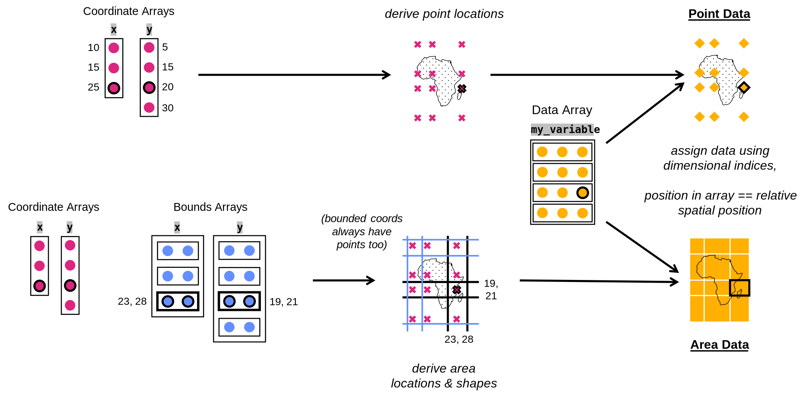
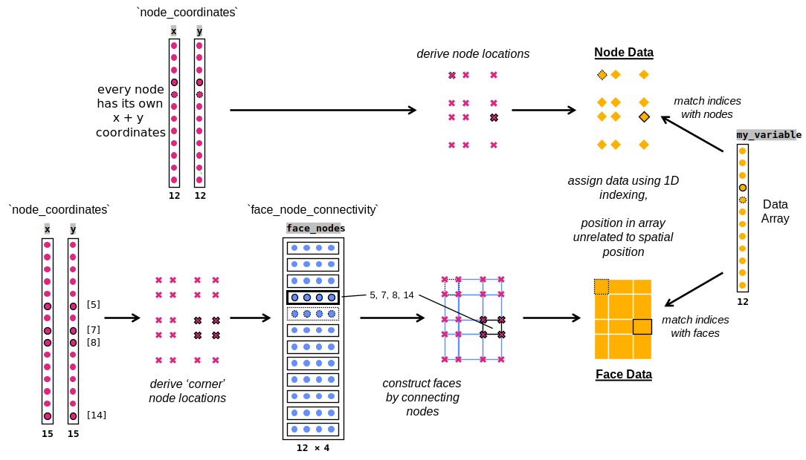
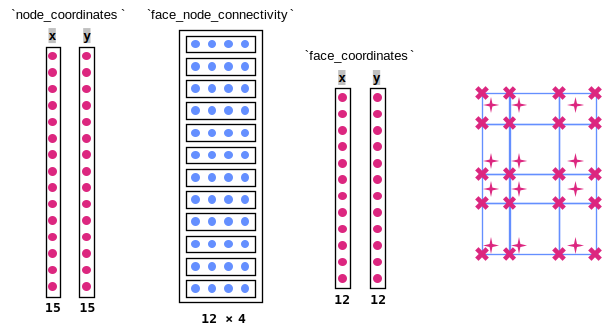
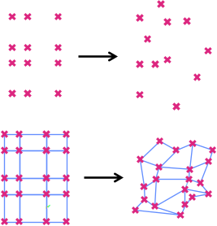
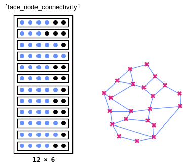
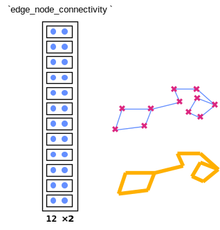

.. include:: ../../common_links.inc

.. _ugrid model:

The Mesh Data Model
*******************

.. important::

        This page is intended to summarise the essentials that Iris users need
        to know about meshes. For exhaustive details on UGRID itself:
        `visit the official UGRID conventions site`__.

Evolution, not revolution
=========================
Mesh support has been designed wherever possible to fit within the existing
Iris model. Meshes concern only the spatial geography of data, and can
optionally be limited to just the horizontal geography (e.g. X and Y). Other
dimensions such as time or ensemble member (and often vertical levels)
retain their familiar structured format.

The UGRID conventions themselves are designed as an addition to the existing CF
conventions, which are at the core of Iris' philosophy.

What's Different?
=================

The mesh format represents data's geography using an **unstructured
mesh**. This has significant pros and cons when compared to a structured grid.

.. contents::
   :local:

The Detail
----------
..
    The diagram images are SVG's, so editable by any graphical software
     (e.g. Inkscape). They were originally made in MS PowerPoint.

    Uses the IBM Colour Blind Palette (see
     https://ibm-design-language.eu-de.mybluemix.net/design/language/resources/color-library
     )

Structured Grids (the old world)
~~~~~~~~~~~~~~~~~~~~~~~~~~~~~~~~
Assigning data to locations using a structured grid is essentially an act of
matching coordinate arrays to each dimension of the data array. The data can
also be represented as an area (instead of a point) by including a bounds array
for each coordinate array. :ref:`data_structured_grid` visualises an
example.

..  _data_structured_grid:

    Data on a structured grid.

    1D coordinate arrays (pink circles) are combined to construct a structured
    grid of points (pink crosses). 2D bounds arrays (blue circles) can also be
    used to describe the 1D boundaries (blue lines) at either side of each
    rank of points; each point therefore having four bounds (x+y, upper+lower),
    together describing a quadrilateral area around that point. Data from the
    2D data array (orange circles) can be assigned to these point locations
    (orange diamonds) or area locations (orange quads) by matching the relative
    positions in the data array to the relative spatial positions - see the
    black outlined shapes as examples of this in action.

Unstructured Meshes (the new world)
~~~~~~~~~~~~~~~~~~~~~~~~~~~~~~~~~~~
A mesh is made up of different types of **element**:

.. list-table::
    :widths: 15, 15, 70

    * - 0D
      - ``node``
      - The 'core' of the mesh. A point position in space, constructed from
        2 or 3 coordinates (2D or 3D space).
    * - 1D
      - ``edge``
      - Constructed by connecting 2 nodes.
    * - 2D
      - ``face``
      - Constructed by connecting 3 or more nodes.
    * - 3D
      - ``volume``
      - Constructed by connecting 4 or more nodes (which must each have 3
        coordinates - 3D space).

Every node in the mesh is defined by indexing the 1-dimensional X and Y (and
optionally Z) coordinate arrays (the ``node_coordinates``) - e.g.
``(x[3], y[3])`` gives the position of the fourth node. Note that this means
each node has its own coordinates, independent of every other node.

Any higher dimensional element - an edge/face/volume - is described by a
sequence of the indices of the nodes that make up that element. E.g. a
triangular face made from connecting the first, third and fourth nodes:
``[0, 2, 3]``. These 1D sequences combine into a 2D array enumerating **all**
the elements of that type - edge/face/volume - called a **connectivity**.
E.g. we could make a mesh of 4 nodes, with 2 triangles described using this
``face_node_connectivity``: ``[[0, 2, 3], [3, 2, 1]]`` (note the shared nodes).

.. note:: More on Connectivities:

        * The element type described by a connectivity is known as its
          **location**; ``edge`` in ``edge_node_connectivity``.
        * According to the UGRID conventions, the nodes in a face should be
          listed in "anti-clockwise order from above".
        * Connectivities also exist to connect the higher dimensional elements,
          e.g. ``face_edge_connectivity``. These are optional conveniences to
          speed up certain operations and will not be discussed here.

.. important::

        **Meshes are unstructured**. The mesh elements - represented in the
        coordinate and connectivity arrays detailed above - are enumerated
        along a single **unstructured dimension**. An element's position along
        this dimension has nothing to do with its spatial position.

A data variable associated with a mesh has a **location** of either ``node``,
``edge``, ``face`` or ``volume``. The data is stored in a 1D array with one
datum per element, matched to its element by matching the datum index with the
coordinate or connectivity index along the **unstructured dimension**. So for
an example data array called ``foo``:
``foo[3]`` would be at position ``(x[3], y[3])`` if it were node-located, or at
``faces[3]`` if it were face-located. :ref:`data_ugrid_mesh` visualises an
example of what is described above.

..  _data_ugrid_mesh:

    Data on an unstructured mesh

    1D coordinate arrays (pink circles) describe node positions in space (pink
    crosses). A 2D connectivity array (blue circles) describes faces by
    connecting four nodes - by referencing their indices - into a face outline
    (blue outlines on the map). Data from the 1D data array (orange circles)
    can be assigned to these node locations (orange diamonds) or face locations
    (orange quads) by matching the indices in the data array to the indices in
    the coordinate arrays (for nodes) or connectivity array (for faces). See
    the black outlined shapes as examples of index matching in action, and the
    black stippled shapes to demonstrate that relative array position confers
    no relative spatial information.

----

The mesh model also supports edges/faces/volumes having associated 'centre'
coordinates - to allow point data to be assigned to these elements. 'Centre' is
just a convenience term - the points can exist anywhere within their respective
elements. See :ref:`ugrid_element_centres` for a visualised example.

..  _ugrid_element_centres:

    Data can be assigned to mesh edge/face/volume 'centres'

    1D *node* coordinate arrays (pink circles) describe node positions in
    space (pink crosses). A 2D connectivity array (blue circles) describes
    faces by connecting four nodes into a face outline (blue outlines on the
    map). Further 1D *face* coordinate arrays (pink circles) describe a
    'centre' point position (pink stars) for each face enumerated in the
    connectivity array.

Mesh Flexibility
++++++++++++++++
Above we have seen how one could replicate data on a structured grid using
a mesh instead. But the utility of a mesh is the extra flexibility it offers.
Here are the main examples:

Every node is completely independent - every one can have unique X andY (and Z) coordinate values. See :ref:`ugrid_node_independence`.

..  _ugrid_node_independence:

    Every mesh node is completely independent

    The same array shape and structure used to describe the node positions
    (pink crosses) in a regular grid (left-hand maps) is equally able to
    describe **any** position for these nodes (e.g. the right-hand maps),
    simply by changing the array values. The quadrilateral faces (blue
    outlines) can therefore be given any quadrilateral shape by re-positioning
    their constituent nodes.

Faces and volumes can have variable node counts, i.e. different numbers of
sides. This is achieved by masking the unused 'slots' in the connectivity
array. See :ref:`ugrid_variable_faces`.

..  _ugrid_variable_faces:

    Mesh faces can have different node counts (using masking)

    The 2D connectivity array (blue circles) describes faces by connecting
    nodes (pink crosses) to make up a face (blue outlines). The faces can use
    different numbers of nodes by shaping the connectivity array to accommodate
    the face with the most nodes, then masking unused node 'slots'
    (black circles) for faces with fewer nodes than the maximum.

Data can be assigned to lines (edges) just as easily as points (nodes) or
areas (faces). See :ref:`ugrid_edge_data`.

..  _ugrid_edge_data:

    Data can be assigned to mesh edges

    The 2D connectivity array (blue circles) describes edges by connecting 2
    nodes (pink crosses) to make up an edge (blue lines). Data can be assigned
    to the edges (orange lines) by matching the indices of the 1D data array
    (not shown) to the indices in the connectivity array.

.. _ugrid implications:

What does this mean?
--------------------
Meshes can represent much more varied spatial arrangements
~~~~~~~~~~~~~~~~~~~~~~~~~~~~~~~~~~~~~~~~~~~~~~~~~~~~~~~~~~
The highly specific way of recording position (geometry) and shape
(topology) allows meshes to represent essentially **any** spatial arrangement
of data. There are therefore many new applications that aren't possible using a
structured grid, including:

* `The UK Met Office's LFRic cubed-sphere <https://hps.vi4io.org/_media/events/2018/sig-io-uk-adams.pdf>`_
* `Oceanic model outputs <https://doi.org/10.3390/jmse2010194>`_

.. todo:
        a third example!

Mesh 'payload' is much larger than with structured grids
~~~~~~~~~~~~~~~~~~~~~~~~~~~~~~~~~~~~~~~~~~~~~~~~~~~~~~~~
Coordinates are recorded per-node, and connectivities are recorded per-element.
This is opposed to a structured grid, where a single coordinate value is shared
by every data point/area along that line.

For example: representing the surface of a cubed-sphere using a mesh leads to
coordinates and connectivities being **~8 times larger than the data itself**,
as opposed to a small fraction of the data size when dividing a spherical
surface using a structured grid of longitudes and latitudes.

This further increases the emphasis on lazy loading and processing of data
using packages such as Dask.

.. note::

        The large, 1D data arrays associated with meshes are a very different
        shape to what Iris users and developers are used to. It is suspected
        that optimal performance will need new chunking strategies, but at time
        of writing (``Jan 2022``) experience is still limited.

.. todo:
        Revisit when we have more information.

Spatial operations on mesh data are more complex
~~~~~~~~~~~~~~~~~~~~~~~~~~~~~~~~~~~~~~~~~~~~~~~~
Detail: :doc:`operations`

Indexing a mesh data array cannot be used for:

#. Region selection
#. Neighbour identification

This is because - unlike with a structured data array - relative position in
a mesh's 1-dimensional data arrays has no relation to relative position in
space. We must instead perform specialised operations using the information in
the mesh's connectivities, or by translating the mesh into a format designed
for mesh analysis such as VTK.

Such calculations can still be optimised to avoid them slowing workflows, but
the important take-away here is that **adaptation is needed when working mesh
data**.

How Iris Represents This
========================

..
    Include API links to the various classes

    Include Cube/Mesh printout(s)

.. seealso::

        Remember this is a prose summary. Precise documentation is at:
        :mod:`iris.mesh`.

.. note::

        At time of writing (``Jan 2022``), neither 3D meshes nor 3D elements
        (volumes) are supported.

The Basics
----------
The Iris :class:`~iris.cube.Cube` has several new members:

* | :attr:`~iris.cube.Cube.mesh`
  | The :class:`iris.mesh.MeshXY` that describes the
    :class:`~iris.cube.Cube`\'s horizontal geography.
* | :attr:`~iris.cube.Cube.location`
  | ``node``/``edge``/``face`` - the mesh element type with which this
    :class:`~iris.cube.Cube`\'s :attr:`~iris.cube.Cube.data` is associated.
* | :meth:`~iris.cube.Cube.mesh_dim`
  | The :class:`~iris.cube.Cube`\'s **unstructured dimension** - the one that
    indexes over the horizontal :attr:`~iris.cube.Cube.data` positions.

These members will all be ``None`` for a :class:`~iris.cube.Cube` with no
associated :class:`~iris.mesh.MeshXY`.

This :class:`~iris.cube.Cube`\'s unstructured dimension has multiple attached
:class:`iris.mesh.MeshCoord`\s (one for each axis e.g.
``x``/``y``), which can be used to infer the points and bounds of any index on
the :class:`~iris.cube.Cube`\'s unstructured dimension.

.. testsetup:: ugrid_summaries

        import numpy as np

        from iris.coords import AuxCoord, DimCoord
        from iris.cube import Cube
        from iris.mesh import Connectivity, MeshXY

        node_x = AuxCoord(
                     points=[0.0, 5.0, 0.0, 5.0, 8.0],
                     standard_name="longitude",
                     units="degrees_east",
                 )
        node_y = AuxCoord(
                     points=[3.0, 3.0, 0.0, 0.0, 0.0],
                     standard_name="latitude",
                     units="degrees_north",
                 )

        edge_node_c = Connectivity(
            indices=[[0, 1], [0, 2], [1, 3], [1, 4], [2, 3], [3, 4]],
            cf_role="edge_node_connectivity",
        )

        face_indices = np.ma.masked_equal([[0, 1, 3, 2], [1, 4, 3, 999]], 999)
        face_node_c = Connectivity(
            indices=face_indices, cf_role="face_node_connectivity"
        )

        def centre_coords(conn):
            indexing = np.ma.filled(conn.indices, 0)
            x, y = [
                AuxCoord(
                    node_coord.points[indexing].mean(axis=conn.connected_axis),
                    node_coord.standard_name,
                    units=node_coord.units,
                )
                for node_coord in (node_x, node_y)
            ]
            return [(x, "x"), (y, "y")]

        my_mesh = MeshXY(
            long_name="my_mesh",
            topology_dimension=2,
            node_coords_and_axes=[(node_x, "x"), (node_y, "y")],
            connectivities=[edge_node_c, face_node_c],
            edge_coords_and_axes=centre_coords(edge_node_c),
            face_coords_and_axes=centre_coords(face_node_c),
        )

        vertical_levels = DimCoord([0, 1, 2], "height")

        def location_cube(conn):
           location = conn.location
           mesh_coord_x, mesh_coord_y = my_mesh.to_MeshCoords(location)
           data_shape = (conn.shape[conn.location_axis], len(vertical_levels.points))
           data_array = np.arange(np.prod(data_shape)).reshape(data_shape)

           return Cube(
               data=data_array,
               long_name=f"{location}_data",
               units="K",
               dim_coords_and_dims=[(vertical_levels, 1)],
               aux_coords_and_dims=[(mesh_coord_x, 0), (mesh_coord_y, 0)],
           )

        edge_cube = location_cube(edge_node_c)
        face_cube = location_cube(face_node_c)

.. doctest:: ugrid_summaries

        >>> print(edge_cube)
        edge_data / (K)                     (-- : 6; height: 3)
            Dimension coordinates:
                height                          -          x
            Mesh coordinates:
                latitude                        x          -
                longitude                       x          -
            Mesh:
                name                        my_mesh
                location                    edge

        >>> print(edge_cube.location)
        edge

        >>> print(edge_cube.mesh_dim())
        0

        >>> print(edge_cube.mesh.summary(shorten=True))
        <MeshXY: 'my_mesh'>

The Detail
----------
How UGRID information is stored
~~~~~~~~~~~~~~~~~~~~~~~~~~~~~~~
* | :class:`iris.mesh.MeshXY`
  | Contains all information about the mesh.
  | Includes:

  * | :attr:`~iris.mesh.MeshXY.topology_dimension`
    | The maximum dimensionality of shape (1D=edge, 2D=face) supported
      by this :class:`~iris.mesh.MeshXY`. Determines which
      :class:`~iris.mesh.Connectivity`\s are required/optional
      (see below).

  * 1-3 collections of :class:`iris.coords.AuxCoord`\s:

    * | **Required**: :attr:`~iris.mesh.MeshXY.node_coords`
      | The nodes that are the basis for the mesh.
    * | Optional: :attr:`~iris.mesh.Mesh.edge_coords`,
        :attr:`~iris.mesh.MeshXY.face_coords`
      | For indicating the 'centres' of the edges/faces.
      | **NOTE:** generating a :class:`~iris.mesh.MeshCoord` from
        a :class:`~iris.mesh.MeshXY` currently (``Jan 2022``)
        requires centre coordinates for the given ``location``; to be rectified
        in future.

  * 1 or more :class:`iris.mesh.Connectivity`\s:

    * | **Required for 1D (edge) elements**:
        :attr:`~iris.mesh.MeshXY.edge_node_connectivity`
      | Define the edges by connecting nodes.
    * | **Required for 2D (face) elements**:
        :attr:`~iris.mesh.MeshXY.face_node_connectivity`
      | Define the faces by connecting nodes.
    * Optional: any other connectivity type. See
      :attr:`iris.mesh.Connectivity.UGRID_CF_ROLES` for the
      full list of types.

.. doctest:: ugrid_summaries

        >>> print(edge_cube.mesh)
        MeshXY : 'my_mesh'
            topology_dimension: 2
            node
                node_dimension: 'Mesh2d_node'
                node coordinates
                    <AuxCoord: longitude / (degrees_east)  [...]  shape(5,)>
                    <AuxCoord: latitude / (degrees_north)  [...]  shape(5,)>
            edge
                edge_dimension: 'Mesh2d_edge'
                edge_node_connectivity: <Connectivity: unknown / (unknown)  [...]  shape(6, 2)>
                edge coordinates
                    <AuxCoord: longitude / (degrees_east)  [...]  shape(6,)>
                    <AuxCoord: latitude / (degrees_north)  [...]  shape(6,)>
            face
                face_dimension: 'Mesh2d_face'
                face_node_connectivity: <Connectivity: unknown / (unknown)  [...]  shape(2, 4)>
                face coordinates
                    <AuxCoord: longitude / (degrees_east)  [...]  shape(2,)>
                    <AuxCoord: latitude / (degrees_north)  [...]  shape(2,)>
            long_name: 'my_mesh'

* | :class:`iris.mesh.MeshCoord`
  | Described in detail in `MeshCoords`_.
  | Stores the following information:

  * | :attr:`~iris.mesh.MeshCoord.mesh`
    | The :class:`~iris.mesh.MeshXY` associated with this
      :class:`~iris.mesh.MeshCoord`. This determines the
      :attr:`~iris.cube.Cube.mesh` attribute of any :class:`~iris.cube.Cube`
      this :class:`~iris.mesh.MeshCoord` is attached to (see
      `The Basics`_)

  * | :attr:`~iris.mesh.MeshCoord.location`
    | ``node``/``edge``/``face`` - the element detailed by this
      :class:`~iris.mesh.MeshCoord`. This determines the
      :attr:`~iris.cube.Cube.location` attribute of any
      :class:`~iris.cube.Cube` this
      :class:`~iris.mesh.MeshCoord` is attached to (see
      `The Basics`_).

.. _ugrid MeshCoords:

MeshCoords
~~~~~~~~~~
Links a :class:`~iris.cube.Cube` to a :class:`~iris.mesh.MeshXY` by
attaching to the :class:`~iris.cube.Cube`\'s unstructured dimension, in the
same way that all :class:`~iris.coords.Coord`\s attach to
:class:`~iris.cube.Cube` dimensions. This allows a single
:class:`~iris.cube.Cube` to have a combination of unstructured and structured
dimensions (e.g. horizontal mesh plus vertical levels and a time series),
using the same logic for every dimension.

:class:`~iris.mesh.MeshCoord`\s are instantiated using a given
:class:`~iris.mesh.MeshXY`, ``location``
("node"/"edge"/"face") and ``axis``. The process interprets the
:class:`~iris.mesh.MeshXY`\'s
:attr:`~iris.mesh.MeshXY.node_coords` and if appropriate the
:attr:`~iris.mesh.MeshXY.edge_node_connectivity`/
:attr:`~iris.mesh.MeshXY.face_node_connectivity` and
:attr:`~iris.mesh.MeshXY.edge_coords`/
:attr:`~iris.mesh.MeshXY.face_coords`
to produce a :class:`~iris.coords.Coord`
:attr:`~iris.coords.Coord.points` and :attr:`~iris.coords.Coord.bounds`
representation of all the :class:`~iris.mesh.MeshXY`\'s
nodes/edges/faces for the given axis.

The method :meth:`iris.mesh.MeshXY.to_MeshCoords` is available to
create a :class:`~iris.mesh.MeshCoord` for
every axis represented by that :class:`~iris.mesh.MeshXY`,
given only the ``location`` argument

.. doctest:: ugrid_summaries

        >>> for coord in edge_cube.coords(mesh_coords=True):
        ...     print(coord)
        MeshCoord :  latitude / (degrees_north)
            mesh: <MeshXY: 'my_mesh'>
            location: 'edge'
            points: [3. , 1.5, 1.5, 1.5, 0. , 0. ]
            bounds: [
                [3., 3.],
                [3., 0.],
                [3., 0.],
                [3., 0.],
                [0., 0.],
                [0., 0.]]
            shape: (6,)  bounds(6, 2)
            dtype: float64
            standard_name: 'latitude'
            axis: 'y'
        MeshCoord :  longitude / (degrees_east)
            mesh: <MeshXY: 'my_mesh'>
            location: 'edge'
            points: [2.5, 0. , 5. , 6.5, 2.5, 6.5]
            bounds: [
                [0., 5.],
                [0., 0.],
                [5., 5.],
                [5., 8.],
                [0., 5.],
                [5., 8.]]
            shape: (6,)  bounds(6, 2)
            dtype: float64
            standard_name: 'longitude'
            axis: 'x'

__ CF-UGRID_