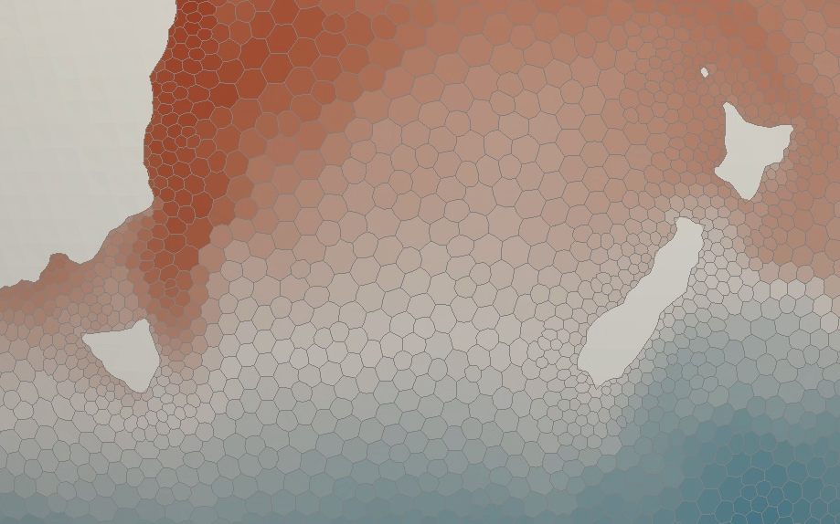
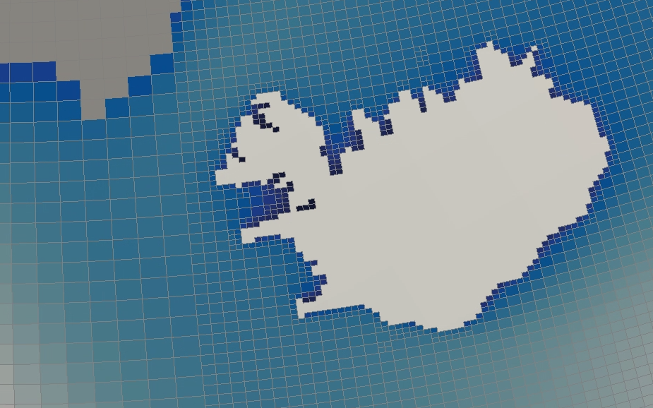
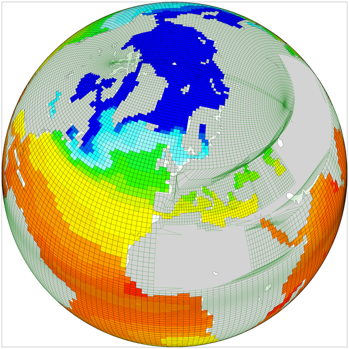

.. _other_meshes:

Converting Other Mesh Formats
*****************************

Iris' Mesh Data Model is based primarily on the CF-UGRID conventions  (see
:doc:`data_model`), but other mesh formats can be converted to fit into this
model, **enabling use of Iris' specialised mesh support**. Below are some
examples demonstrating how this works for various mesh formats.

.. contents::
    :local:

`FESOM 1.4`_ Voronoi Polygons
-----------------------------

A FESOM mesh encoded in a NetCDF file includes:

* X+Y point coordinates
* X+Y corners coordinates of the Voronoi Polygons around these points -
  represented as the bounds of the coordinates

To represent the Voronoi Polygons as faces, the corner coordinates will be used
as the **nodes** when creating the Iris
:class:`~iris.experimental.ugrid.mesh.Mesh`.

.. dropdown:: Code
    :icon: code

    .. code-block:: python

        >>> import iris
        >>> from iris.experimental.ugrid import Mesh

        >>> temperature_cube = iris.load_cube("my_file.nc", "sea_surface_temperature")
        >>> print(temperature_cube)
        sea_surface_temperature / (degC)    (time: 12; -- : 126859)
            Dimension coordinates:
                time                             x        -
            Auxiliary coordinates:
                latitude                         -        x
                longitude                        -        x
            Cell methods:
                0                           area: mean where sea
                1                           time: mean
            Attributes:
                grid                        'FESOM 1.4 (unstructured grid in the horizontal with 126859 wet nodes;...
                ...

        >>> print(temperature_cube.coord("longitude"))
        AuxCoord :  longitude / (degrees)
            points: <lazy>
            bounds: <lazy>
            shape: (126859,)  bounds(126859, 18)
            dtype: float64
            standard_name: 'longitude'
            var_name: 'lon'

        # Use a Mesh to represent the Cube's horizontal geography, by replacing
        #  the existing face AuxCoords with new MeshCoords.
        >>> fesom_mesh = Mesh.from_coords(temperature_cube.coord('longitude'),
        ...                               temperature_cube.coord('latitude'))
        >>> for new_coord in fesom_mesh.to_MeshCoords("face"):
        ...     old_coord = temperature_cube.coord(new_coord.name())
        ...     unstructured_dim, = old_coord.cube_dims(temperature_cube)
        ...     temperature_cube.remove_coord(old_coord)
        ...     temperature_cube.add_aux_coord(new_coord, unstructured_dim)

        >>> print(temperature_cube)
        sea_surface_temperature / (degC)    (time: 12; -- : 126859)
            Dimension coordinates:
                time                             x        -
            Mesh coordinates:
                latitude                         -        x
                longitude                        -        x
            Cell methods:
                0                           area: mean where sea
                1                           time: mean
            Attributes:
                grid                        'FESOM 1.4 (unstructured grid in the horizontal with 126859 wet nodes;...
                ...

        >>> print(temperature_cube.mesh)
        Mesh : 'unknown'
            topology_dimension: 2
            node
                node_dimension: 'Mesh2d_node'
                node coordinates
                    <AuxCoord: longitude / (degrees)  <lazy>  shape(2283462,)>
                    <AuxCoord: latitude / (degrees)  <lazy>  shape(2283462,)>
            face
                face_dimension: 'Mesh2d_face'
                face_node_connectivity: <Connectivity: unknown / (unknown)  <lazy>  shape(126859, 18)>
                face coordinates
                    <AuxCoord: longitude / (degrees)  <lazy>  shape(126859,)>
                    <AuxCoord: latitude / (degrees)  <lazy>  shape(126859,)>

`WAVEWATCH III`_ Spherical Multi-Cell (SMC) WAVE Quad Grid
----------------------------------------------------------

An SMC grid encoded in a NetCDF file includes:

* X+Y face centre coordinates
* X+Y base face sizes
* X+Y face size factors

From this information we can derive face corner coordinates, which will be used
as the **nodes** when creating the Iris
:class:`~iris.experimental.ugrid.mesh.Mesh`.

.. dropdown:: Code
    :icon: code

    .. code-block:: python

        >>> import iris
        >>> from iris.experimental.ugrid import Mesh
        >>> import numpy as np

        >>> wave_cube = iris.load_cube("my_file.nc", "sea_surface_wave_significant_height")
        >>> print(wave_cube)
        sea_surface_wave_significant_height / (m) (time: 7; -- : 666328)
            Dimension coordinates:
                time                                   x       -
            Auxiliary coordinates:
                forecast_period                        x       -
                latitude                               -       x
                latitude cell size factor              -       x
                longitude                              -       x
                longitude cell size factor             -       x
            Scalar coordinates:
                forecast_reference_time           2021-12-05 00:00:00
            Attributes:
                SIN4 namelist parameter BETAMAX   1.39
                SMC_grid_type                     'seapoint'
                WAVEWATCH_III_switches            'NOGRB SHRD PR2 UNO SMC FLX0 LN1 ST4 NL1 BT1 DB1 TR0 BS0 IC0 IS0 REF0 WNT1...
                WAVEWATCH_III_version_number      '7.13'
                altitude_resolution               'n/a'
                area                              'Global wave model GS512L4EUK'
                base_lat_size                     0.029296871
                base_lon_size                     0.043945305
                ...

        >>> faces_x = wave_cube.coord("longitude")
        >>> faces_y = wave_cube.coord("latitude")
        >>> face_size_factor_x = wave_cube.coord("longitude cell size factor")
        >>> face_size_factor_y = wave_cube.coord("latitude cell size factor")
        >>> base_x_size = wave_cube.attributes["base_lon_size"]
        >>> base_y_size = wave_cube.attributes["base_lat_size"]

        # Calculate face corners from face centres and face size factors.
        >>> face_centres_x = faces_x.points
        >>> face_centres_y = faces_y.points
        >>> face_size_x = face_size_factor_x.points * base_x_size
        >>> face_size_y = face_size_factor_y.points * base_y_size

        >>> x_mins = (face_centres_x - 0.5 * face_size_x).reshape(-1, 1)
        >>> x_maxs = (face_centres_x + 0.5 * face_size_x).reshape(-1, 1)
        >>> y_mins = (face_centres_y - 0.5 * face_size_y).reshape(-1, 1)
        >>> y_maxs = (face_centres_y + 0.5 * face_size_y).reshape(-1, 1)

        >>> face_corners_x = np.hstack([x_mins, x_maxs, x_maxs, x_mins])
        >>> face_corners_y = np.hstack([y_mins, y_mins, y_maxs, y_maxs])

        # Add face corners as coordinate bounds.
        >>> faces_x.bounds = face_corners_x
        >>> faces_y.bounds = face_corners_y

        # Use a Mesh to represent the Cube's horizontal geography, by replacing
        #  the existing face AuxCoords with new MeshCoords.
        >>> smc_mesh = Mesh.from_coords(faces_x, faces_y)
        >>> for new_coord in smc_mesh.to_MeshCoords("face"):
        ...     old_coord = wave_cube.coord(new_coord.name())
        ...     unstructured_dim, = old_coord.cube_dims(wave_cube)
        ...     wave_cube.remove_coord(old_coord)
        ...     wave_cube.add_aux_coord(new_coord, unstructured_dim)

        >>> print(wave_cube)
        sea_surface_wave_significant_height / (m) (time: 7; -- : 666328)
            Dimension coordinates:
                time                                   x       -
            Mesh coordinates:
                latitude                               -       x
                longitude                              -       x
            Auxiliary coordinates:
                forecast_period                        x       -
                latitude cell size factor              -       x
                longitude cell size factor             -       x
            Scalar coordinates:
                forecast_reference_time           2021-12-05 00:00:00
            Attributes:
                SIN4 namelist parameter BETAMAX   1.39
                SMC_grid_type                     'seapoint'
                WAVEWATCH_III_switches            'NOGRB SHRD PR2 UNO SMC FLX0 LN1 ST4 NL1 BT1 DB1 TR0 BS0 IC0 IS0 REF0 WNT1...
                WAVEWATCH_III_version_number      '7.13'
                altitude_resolution               'n/a'
                area                              'Global wave model GS512L4EUK'
                base_lat_size                     0.029296871
                base_lon_size                     0.043945305
                ...

        >>> print(wave_cube.mesh)
        Mesh : 'unknown'
            topology_dimension: 2
            node
                node_dimension: 'Mesh2d_node'
                node coordinates
                    <AuxCoord: longitude / (degrees)  [...]  shape(2665312,)>
                    <AuxCoord: latitude / (degrees)  [...]  shape(2665312,)>
            face
                face_dimension: 'Mesh2d_face'
                face_node_connectivity: <Connectivity: unknown / (unknown)  [...]  shape(666328, 4)>
                face coordinates
                    <AuxCoord: longitude / (degrees)  [...]  shape(666328,)>
                    <AuxCoord: latitude / (degrees)  [...]  shape(666328,)>

.. _ORCA_example:

`NEMO`_ data on ORCA tripolar grid
----------------------------------

NEMO can use various grids, but is frequently used with ORCA type grids.
ORCA grids store global data in 2-dimensional ny * nx arrays.  All cells are
four-sided.  The grids are based on tri-polar layouts, but X and Y spacings are
irregular and not given by any defined functional forms.

* arrays (ny, nx) of face-located data variables
* arrays (ny, nx) of X+Y face centre coordinates
* arrays (ny, nx, 4) of X+Y face corner coordinates
  (all faces are quadrilaterals)

For simplicity, we treat each face corner as an independent node, and use a face-node
connectivity which simply lists the nodes in sequence,
i.e. [[0, 1, 2, 3], [4, 5, 6, 7], ...].

.. Note::
    This is the simplest solution, but produces approx 4x more nodes than
    necessary, since the coordinate bounds contain many duplicate locations.
    Removing the duplicates is quite easy, but often not necessary.

To make an unstructured cube, the data must be 'flattened' to convert the given X and Y
dimensions into a single mesh dimension.  Since Iris cubes don't support a "reshape" or
"flatten" operations, we create a new cube from the flattened data.

.. dropdown:: Code
    :icon: code

    .. code-block:: python

        >>> import numpy as np
        >>> import iris
        >>> from iris.coords import AuxCoord, CellMeasure
        >>> from iris.cube import Cube
        >>> from iris.experimental.ugrid.mesh import Mesh, Connectivity

        >>> filepath = iris.sample_data_path('orca2_votemper.nc')
        >>> cube = iris.load_cube(filepath)
        >>> print(cube)
        sea_water_potential_temperature / (degC) (-- : 148; -- : 180)
            Auxiliary coordinates:
                latitude                             x         x
                longitude                            x         x
            Scalar coordinates:
                depth                            4.999938 m, bound=(0.0, 10.0) m
                time                             0001-01-01 12:00:00
            Cell methods:
                0                                time: mean
            Attributes:
                Conventions                      'CF-1.5'

        >>> co_x =  cube.coord("longitude")
        >>> co_y = cube.coord("latitude")
        >>> ny, nx = co_x.shape
        >>> n_faces = ny * nx

        >>> # Create face coords from flattened face-points
        >>> face_x_co = AuxCoord(co_x.points.flatten())
        >>> face_y_co = AuxCoord(co_y.points.flatten())
        >>> assert face_x_co.shape == (n_faces,)
        >>> face_x_co.metadata = co_x.metadata
        >>> face_y_co.metadata = co_y.metadata

        >>> # Create node coordinates from bound points.
        >>> n_nodes = n_faces * 4
        >>> node_x_co = AuxCoord(co_x.bounds.flatten())
        >>> node_y_co = AuxCoord(co_y.bounds.flatten())
        >>> assert node_x_co.shape == (n_nodes,)
        >>> node_x_co.metadata = co_x.metadata
        >>> node_y_co.metadata = co_y.metadata

        >>> # Create a face-node Connectivity matching the order of nodes in the bounds array
        >>> face_node_inds = np.arange(n_nodes).reshape((n_faces, 4))
        >>> face_nodes_conn = Connectivity(
        ...     indices=face_node_inds,
        ...     cf_role='face_node_connectivity',
        ...     long_name='face_inds', units='1',
        ... )

        >>> # Create a mesh object.
        >>> mesh = Mesh(
        ...     topology_dimension=2,
        ...     node_coords_and_axes=[(node_x_co, 'x'), (node_y_co, 'y')],
        ...     connectivities=face_nodes_conn,
        ...     face_coords_and_axes=[(face_x_co, 'x'), (face_y_co, 'y')]
        ... )
        >>> print(mesh)
        Mesh : 'unknown'
            topology_dimension: 2
            node
                node_dimension: 'Mesh2d_node'
                node coordinates
                    <AuxCoord: longitude / (degrees)  [...]  shape(106560,)>
                    <AuxCoord: latitude / (degrees)  [...]  shape(106560,)>
            face
                face_dimension: 'Mesh2d_face'
                face_node_connectivity: <Connectivity: face_inds / (1)  [...]  shape(26640, 4)>
                face coordinates
                    <AuxCoord: longitude / (degrees)  [...]  shape(26640,)>
                    <AuxCoord: latitude / (degrees)  [...]  shape(26640,)>

        >>> # Create an unstructured version of the input with flattened data
        >>> meshcube = Cube(cube.core_data().flatten())
        >>> meshcube.metadata = cube.metadata

        >>> # Attach the mesh by adding the mesh 'face' MeshCoords into the cube
        >>> mesh_dim = meshcube.ndim - 1
        >>> for co in mesh.to_MeshCoords('face'):
        ...     meshcube.add_aux_coord(co, mesh_dim)
        ...

        >>> print(meshcube)
        sea_water_potential_temperature / (degC) (-- : 26640)
            Mesh coordinates:
                latitude                             x
                longitude                            x
            Mesh:
                name                             unknown
                location                         face
            Cell methods:
                0                                time: mean
            Attributes:
                Conventions                      'CF-1.5'

.. _WAVEWATCH III: https://github.com/NOAA-EMC/WW3
.. _FESOM 1.4: https://fesom.de/models/fesom14/
.. _NEMO: https://www.nemo-ocean.eu/