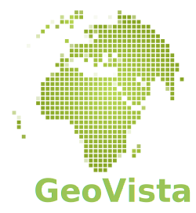

.. _ugrid partners:

Iris' Mesh Partner Packages
****************************
Python is an easy to use language and has formed a very strong collaborative
scientific community, which is why Iris is written in Python. But it is not as
computationally strong as other languages, and this is a problem for working
with unstructured meshes where computations are higher in volume and complexity
(:ref:`see the data model detail <ugrid implications>`). So there are
operations - which Python can perform acceptably on structured grids - which
need unworkably large time/resource to perform on an unstructured mesh. New
approaches are needed...

Python packages already exist that enable the use of powerful mesh analysis
tools originally written in faster languages such as C. And the Iris team are
working on wrapper solutions to 'bridge the gap' between these packages and
Iris.

These solutions have been placed in their own 'partner packages' for several
reasons:

* Can be useful to others who are not using Iris.

  * Everyone working with multi-dimensional geographic datasets shares common
    problems that need solving.
  * Wider user base = stronger community = better solutions.

* Only some Iris users will need them - they are **optional** Iris dependencies.

  * They introduce a lot of new API.
  * They introduce new large dependencies that take time to install and need
    disk space.

Below you can learn more about the partner packages and how they are useful.
Specifics of what operations would require their installation can be found in:
:doc:`operations`.

.. important:: **Experimental**

        As with Iris' mesh support, these packages are still in the
        experimental stages. They would love your feedback, but as immature
        packages their API, documentation, test coverage and CI are still
        'under construction'.

.. _`ugrid geovista`:

`GeoVista`_
===========

.. rubric:: "Cartographic rendering and mesh analytics powered by `PyVista`_"

PyVista is described as "VTK for humans" - VTK is a very powerful toolkit for
working with meshes, and PyVista brings that power into the Python ecosystem.
GeoVista in turn makes it easy to use PyVista specifically for cartographic
work, designed from the start with the Iris
:class:`~iris.experimental.ugrid.Mesh` in mind.

Applications
------------
* Interactively plot mesh data:

  * On a 3D globe.
  * On your favourite projection.

* Extract a specific region from a mesh.
* Combine multiple meshes into one.

.. _`ugrid iris-esmf-regrid`:

`iris-esmf-regrid`_
===================

.. rubric:: "A collection of structured and unstructured ESMF regridding schemes for Iris"

ESMF provide a sophisticated, performant regridding utility that supports a
variety of regridding types with both structured grids and unstructured meshes,
and this also has a flexible Python interface - ESMPy. iris-esmf-regrid takes
advantage of having a specific use-case - regridding Iris
:class:`~iris.cube.Cube`\s - to provide ESMPy-Iris wrappers that make the
process as easy as possible, with highly optimised performance.

Applications
------------
* Regrid structured to unstructured.
* Regrid unstructured to structured.
* Regrid while maintaining data laziness.
* Save a prepared regridder for re-use in subsequent runs.

.. _GeoVista: https://github.com/bjlittle/geovista
.. _PyVista: https://docs.pyvista.org/index.html
.. _iris-esmf-regrid: https://github.com/SciTools-incubator/iris-esmf-regrid
