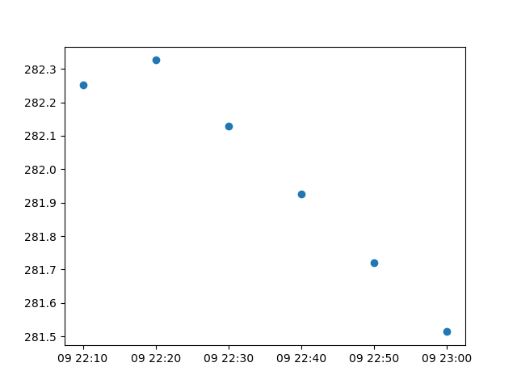

.. explanation:: Temporal Coordinates
    :tags: topic_data_model;topic_plotting

    Patterns for working with temporal coordinates.

.. include:: ../../common_links.inc

.. _explanation-temporal-coordinates:

Temporal Coordinates
====================

.. readingtime::

Here we provide some handy patterns and tips for working with temporal
coordinates i.e., ``time`` coordinates. 

Introduction
------------

.. testsetup::

    import iris

    iris.FUTURE.date_microseconds = True
    fname = iris.sample_data_path("colpex.pp")
    cube = iris.load_cube(fname, "air_potential_temperature")

First, let's familiarise ourselves with the ``time`` coordinate that we'll be
working with::

    >>> tcoord = cube.coord("time")
    >>> tcoord
    <DimCoord: time / (hours since 1970-01-01 00:00:00)  [...]  shape(6,)>

Let's break down this coordinate summary so that we understand each of its
individual components:

* ``DimCoord`` - This is the coordinate *type*, which may be either a
  :class:`~iris.coords.DimCoord` or :class:`~iris.coords.AuxCoord`. A
  *dimensional coordinate* (:class:`~iris.coords.DimCoord`) must be numeric,
  strictly monotonic, have no missing data, and at most 1D. Otherwise, it's an
  *auxiliary coordinate* (:class:`~iris.coords.AuxCoord`), which is not restricted
  by data type nor dimensionality.
* ``time`` - This is the *name* of the coordinate. The name is derived firstly
  from the coordinate ``standard_name``. Failing that, the ``long_name`` is
  used, otherwise the ``var_name`` before defaulting to a value of ``unknown``.
* ``hours since 1970-01-01 00:00:00`` - This tells us the coordinates temporal
  units of measure (``hours``) relative to its epoch (``1970-01-01 00:00:00``).
* ``[...]`` - Represents the temporal ``points``, the values of which are not
  displayed in this shortend summary. However, note that if the coordinate had
  ``bounds`` this would be represented as ``[...]+bounds``.
* ``shape(6,)`` - Tells us that the coordinate has one dimension containing
  ``6`` points.

We can easily inspect the ``points`` contained within our ``tcoord``::

    >>> tcoord.points
    array([347926.16666667, 347926.33333333, 347926.5       , 347926.66666667,
       347926.83333333, 347927.        ])

However, these raw values are pretty meaningless on their own. As hinted to above,
these ``points`` are measured in units of ``hours`` relative to the epoch
``1970-01-01 00:00:00``. The metadata defining all this information is available
from the ``units`` attribute of the :class:`coordinate <iris.coords.Coord>`::

    >>> tcoord.units
    Unit('hours since 1970-01-01 00:00:00', calendar='standard')

.. note::

    All temporal coordinates have a ``calendar`` attribute associated with
    their ``units``.
    
In this case our ``tcoord`` has a ``standard`` (or ``gregorian``) calendar and
we can convert its hard to understand raw values into meaningful **date**/**time**
(``YYYY-MM-DD HH:MM:SS``) representations relative to its ``calendar`` and
epoch::

    >>> print(tcoord)
    DimCoord :  time / (hours since 1970-01-01 00:00:00, standard calendar)
    points: [
        2009-09-09 22:10:00, 2009-09-09 22:20:00, 2009-09-09 22:30:00,
        2009-09-09 22:40:00, 2009-09-09 22:50:00, 2009-09-09 23:00:00]
    shape: (6,)
    dtype: float64
    standard_name: 'time'

Now we can clearly see that our ``tcoord`` time interval commences on ``2009-09-09``
at ``22:10:00`` with samples that are each ``10`` minutes apart.

Note that our ``tcoord`` does not have any ``bounds`` associated with it::

    >>> tcoord.has_bounds()
    False
    >>> tcoord.bounds is None
    True

However, as a convenience, we can **guess** the ``bounds`` of a coordinate using
its :meth:`~iris.coords.Coord.guess_bounds` method::

    >>> tcoord.guess_bounds()
    >>> print(tcoord)
    DimCoord :  time / (hours since 1970-01-01 00:00:00, standard calendar)
    points: [
        2009-09-09 22:10:00, 2009-09-09 22:20:00, 2009-09-09 22:30:00,
        2009-09-09 22:40:00, 2009-09-09 22:50:00, 2009-09-09 23:00:00]
    bounds: [
        [2009-09-09 22:05:00, 2009-09-09 22:15:00],
        [2009-09-09 22:15:00, 2009-09-09 22:25:00],
        [2009-09-09 22:25:00, 2009-09-09 22:35:00],
        [2009-09-09 22:35:00, 2009-09-09 22:45:00],
        [2009-09-09 22:45:00, 2009-09-09 22:55:00],
        [2009-09-09 22:55:00, 2009-09-09 23:05:00]]
    shape: (6,)  bounds(6, 2)
    dtype: float64
    standard_name: 'time'

.. warning::

    :meth:`~iris.coords.Coord.guess_bounds` is an **in-place** operation.

.. _explanation-temporal-coordinates-indexing:

Indexing
--------

:class:`Coordinates <iris.coords.Coord>` are *first-class-citizens* and may be
indexed akin to other ``python`` built-in types such as `lists`_ or `tuples`_.

As an example, let's index the **last** sample of the ``tcoord``::

    >>> tsample = tcoord[-1]
    >>> print(tsample)
    DimCoord :  time / (hours since 1970-01-01 00:00:00, standard calendar)
    points: [2009-09-09 23:00:00]
    bounds: [[2009-09-09 22:55:00, 2009-09-09 23:05:00]]
    shape: (1,)  bounds(1, 2)
    dtype: float64
    standard_name: 'time'

.. note::

    Indexing a coordinate returns a **new** instance of the same coordinate type
    i.e., :class:`~iris.coords.AuxCoord` or :class:`~iris.coords.DimCoord`,
    populated with all the :ref:`metadata <metadata>` and associated data i.e.,
    ``points``, or ``points`` and ``bounds``, at the given index/indices.

In the above example, indexing the ``tcoord`` yields a scalar
:class:`~iris.coords.DimCoord` which we can sanity check for equivalence::

    >>> tsample == tcoord[-1]
    True

A **lighter-weight** indexing solution is to leverage the :meth:`~iris.coords.Coord.cell`
method instead::

    >> tcell = tcoord.cell(-1)
    >> tcell
    Cell(point=cftime.DatetimeGregorian(2009, 9, 9, 23, 0, 0, 0, has_year_zero=False), bound=(cftime.DatetimeGregorian(2009, 9, 9, 22, 55, 0, 0, has_year_zero=False), cftime.DatetimeGregorian(2009, 9, 9, 23, 5, 0, 0, has_year_zero=False)))

This returns a :class:`~iris.coords.Cell` object rather than a
:class:`coordinate <iris.coords.Coord>`, which only contains the ``point``, or
``point`` and ``bound`` at the given *index*::

    >>> tcell.point
    cftime.DatetimeGregorian(2009, 9, 9, 23, 0, 0, 0, has_year_zero=False)
    >>> tcell.bound
    (cftime.DatetimeGregorian(2009, 9, 9, 22, 55, 0, 0, has_year_zero=False), cftime.DatetimeGregorian(2009, 9, 9, 23, 5, 0, 0, has_year_zero=False))

.. warning::

    A temporal :class:`~iris.coords.Cell` will **always** contain
    :doc:`cftime <cftime:index>` objects rather than native ``python``
    :class:`~datetime.datetime` objects.

The ``tsample`` (:class:`~iris.coords.DimCoord`) and ``tcell``
(:class:`~iris.coords.Cell`) were both generated from the same index of ``tcoord``.
However, the ``tsample`` does not contain rich date/time objects, rather it
contains numerical offsets measured relative to the ``calendar`` and epoch
defined within its ``units``::

    >>> tsample.units
    Unit('hours since 1970-01-01 00:00:00', calendar='standard')
    >>> tsample.points
    array([347927.])
    >>> tsample.bounds
    array([[347926.91666667, 347927.08333333]])

To convert these ``points`` and ``bounds`` into equivalent ``tcell``
:doc:`cftime <cftime:index>` objects, apply the following pattern::

    >>> tsample.units.num2date(tsample.points)
    array([cftime.DatetimeGregorian(2009, 9, 9, 23, 0, 0, 0, has_year_zero=False)],
      dtype=object)
    >>> tsample.units.num2date(tsample.bounds)
    array([[cftime.DatetimeGregorian(2009, 9, 9, 22, 55, 0, 0, has_year_zero=False),
        cftime.DatetimeGregorian(2009, 9, 9, 23, 5, 0, 0, has_year_zero=False)]],
      dtype=object)

.. _explanation-temporal-coordinates-iteration:

Iteration
---------

Akin to :ref:`indexing <explanation-temporal-coordinates-indexing>`, we can also
iterate over :class:`coordinates <iris.coords.Coord>` just as you would naturally
with other ``python`` built-in types such as `lists`_ or `tuples`_.

For example, given our ``tcoord``::

    >>> print(tcoord)
    DimCoord :  time / (hours since 1970-01-01 00:00:00, standard calendar)
    points: [
        2009-09-09 22:10:00, 2009-09-09 22:20:00, 2009-09-09 22:30:00,
        2009-09-09 22:40:00, 2009-09-09 22:50:00, 2009-09-09 23:00:00]
    bounds: [
        [2009-09-09 22:05:00, 2009-09-09 22:15:00],
        [2009-09-09 22:15:00, 2009-09-09 22:25:00],
        [2009-09-09 22:25:00, 2009-09-09 22:35:00],
        [2009-09-09 22:35:00, 2009-09-09 22:45:00],
        [2009-09-09 22:45:00, 2009-09-09 22:55:00],
        [2009-09-09 22:55:00, 2009-09-09 23:05:00]]
    shape: (6,)  bounds(6, 2)
    dtype: float64
    standard_name: 'time'

We can easily iterate over each index::

    >>> from pprint import pprint
    >>> pprint(list(tcoord))
    [<DimCoord: time / (hours since 1970-01-01 00:00:00)  [2009-09-09 22:10:00]+bounds>,
     <DimCoord: time / (hours since 1970-01-01 00:00:00)  [2009-09-09 22:20:00]+bounds>,
     <DimCoord: time / (hours since 1970-01-01 00:00:00)  [2009-09-09 22:30:00]+bounds>,
     <DimCoord: time / (hours since 1970-01-01 00:00:00)  [2009-09-09 22:40:00]+bounds>,
     <DimCoord: time / (hours since 1970-01-01 00:00:00)  [2009-09-09 22:50:00]+bounds>,
     <DimCoord: time / (hours since 1970-01-01 00:00:00)  [2009-09-09 23:00:00]+bounds>]

Note that this is functionally equivalent to the following:

.. code-block:: python

    pprint([sample for sample in tcoord])

Both of the above patterns generate a list of scalar :class:`~iris.coords.DimCoord`
objects at each coordinate index in ``tcoord``.

.. note::

    Iterating over a coordinate returns a **new** instance of the same coordinate
    type i.e., :class:`~iris.coords.AuxCoord` or :class:`~iris.coords.DimCoord`,
    populated with all the :ref:`metadata <metadata>` and associated data i.e.,
    ``points``, or ``points`` and ``bounds``, for each coordinate index.

Alternatively, we can use the :meth:`~iris.coords.Coord.cells` method to generate
**lighter-weight** :class:`~iris.coords.Cell` objects for each coordinate index
rather than :class:`~iris.coords.DimCoord` objects.

.. seealso::

    :ref:`explanation-temporal-coordinates-indexing` and how-to use the
    :meth:`~iris.coords.Coord.cell` method.

For example, let's generate a list containing only the ``point`` (ignoring the
``bound``) of each :class:`~iris.coords.Cell` in the ``tcoord``::

    >>> pprint([cell.point for cell in tcoord.cells()])
    [cftime.DatetimeGregorian(2009, 9, 9, 22, 10, 0, 0, has_year_zero=False),
    cftime.DatetimeGregorian(2009, 9, 9, 22, 30, 0, 0, has_year_zero=False),
    cftime.DatetimeGregorian(2009, 9, 9, 22, 40, 0, 0, has_year_zero=False),
    cftime.DatetimeGregorian(2009, 9, 9, 22, 20, 0, 0, has_year_zero=False),
    cftime.DatetimeGregorian(2009, 9, 9, 22, 50, 0, 0, has_year_zero=False),
    cftime.DatetimeGregorian(2009, 9, 9, 23, 0, 0, 0, has_year_zero=False)]

.. warning::

    By default a temporal :class:`~iris.coords.Cell` will **always** contain
    :doc:`cftime <cftime:index>` objects rather than native ``python``
    :class:`~datetime.datetime` objects.

Note that, again we can achieve the equivalent result using
:meth:`~cf_units.Unit.num2date`::

    >>> tcoord.units.num2date(tcoord.points)
    array([cftime.DatetimeGregorian(2009, 9, 9, 22, 10, 0, 0, has_year_zero=False),
       cftime.DatetimeGregorian(2009, 9, 9, 22, 20, 0, 0, has_year_zero=False),
       cftime.DatetimeGregorian(2009, 9, 9, 22, 30, 0, 0, has_year_zero=False),
       cftime.DatetimeGregorian(2009, 9, 9, 22, 40, 0, 0, has_year_zero=False),
       cftime.DatetimeGregorian(2009, 9, 9, 22, 50, 0, 0, has_year_zero=False),
       cftime.DatetimeGregorian(2009, 9, 9, 23, 0, 0, 0, has_year_zero=False)],
      dtype=object)

``cftime`` vs ``datetime``
--------------------------

Depending on your workflow, you may wish to deal directly with either
:doc:`cftime <cftime:index>` objects or native ``python``
:class:`~datetime.datetime` objects rather than raw temporal values within
the ``points``/``bounds`` of a :class:`coordinate <iris.coords.Coord>`.

There are several different ways to convert raw temporal values, so let's
consolidating our understanding and enumerate the various options
available to us.

``cftime``
~~~~~~~~~~

The direct approach is to leverage either of the :meth:`~iris.coords.Coord.cell`
or :meth:`~iris.coords.Coord.cells` methods. Both of which provide one or more
:class:`~iris.coords.Cell` objects.

By default a temporal :class:`~iris.coords.Cell` will always contain
:doc:`cftime <cftime:index>` objects for its ``point``, or ``point`` and ``bound``.

.. seealso::

    :ref:`explanation-temporal-coordinates-indexing` and
    :ref:`explanation-temporal-coordinates-iteration` for examples of using
    :meth:`~iris.coords.Coord.cell` and :meth:`~iris.coords.Coord.cells`.

Alternatively, manual conversion to :doc:`cftime <cftime:index>` objects for
the ``points`` or ``bounds`` of a coordinate can be easily achieved with the
following pattern::

    >>> tcoord.units.num2date(tcoord.points)
    array([cftime.DatetimeGregorian(2009, 9, 9, 22, 10, 0, 0, has_year_zero=False),
       cftime.DatetimeGregorian(2009, 9, 9, 22, 20, 0, 0, has_year_zero=False),
       cftime.DatetimeGregorian(2009, 9, 9, 22, 30, 0, 0, has_year_zero=False),
       cftime.DatetimeGregorian(2009, 9, 9, 22, 40, 0, 0, has_year_zero=False),
       cftime.DatetimeGregorian(2009, 9, 9, 22, 50, 0, 0, has_year_zero=False),
       cftime.DatetimeGregorian(2009, 9, 9, 23, 0, 0, 0, has_year_zero=False)],
      dtype=object)
    >>> tcoord.units.num2date(tcoord.bounds)
    array([[cftime.DatetimeGregorian(2009, 9, 9, 22, 5, 0, 0, has_year_zero=False),
        cftime.DatetimeGregorian(2009, 9, 9, 22, 15, 0, 0, has_year_zero=False)],
       [cftime.DatetimeGregorian(2009, 9, 9, 22, 15, 0, 0, has_year_zero=False),
        cftime.DatetimeGregorian(2009, 9, 9, 22, 25, 0, 0, has_year_zero=False)],
       [cftime.DatetimeGregorian(2009, 9, 9, 22, 25, 0, 0, has_year_zero=False),
        cftime.DatetimeGregorian(2009, 9, 9, 22, 35, 0, 0, has_year_zero=False)],
       [cftime.DatetimeGregorian(2009, 9, 9, 22, 35, 0, 0, has_year_zero=False),
        cftime.DatetimeGregorian(2009, 9, 9, 22, 45, 0, 0, has_year_zero=False)],
       [cftime.DatetimeGregorian(2009, 9, 9, 22, 45, 0, 0, has_year_zero=False),
        cftime.DatetimeGregorian(2009, 9, 9, 22, 55, 0, 0, has_year_zero=False)],
       [cftime.DatetimeGregorian(2009, 9, 9, 22, 55, 0, 0, has_year_zero=False),
        cftime.DatetimeGregorian(2009, 9, 9, 23, 5, 0, 0, has_year_zero=False)]],
      dtype=object)

``datetime``
~~~~~~~~~~~~

Converting raw temporal values to native ``python`` :class:`~datetime.datetime`
objects is only valid for ``standard``, ``gregorian`` or ``proleptic_gregorian``
calendar encoded data.

.. seealso::

    :func:`cftime.num2date` for further details.

Given that our example ``tcoord`` has ``standard`` (equivalent to ``gregorian``)
calendar encoded samples::

    >>> tcoord.units
    Unit('hours since 1970-01-01 00:00:00', calendar='standard')

We are safe to convert either of its ``points`` or ``bounds`` to
:class:`~datetime.datetime` equivalent objects using
:meth:`~cf_units.Unit.num2pydate`::

    >>> tcoord.units.num2pydate(tcoord.points)
    array([real_datetime(2009, 9, 9, 22, 10),
       real_datetime(2009, 9, 9, 22, 20),
       real_datetime(2009, 9, 9, 22, 30),
       real_datetime(2009, 9, 9, 22, 40),
       real_datetime(2009, 9, 9, 22, 50),
       real_datetime(2009, 9, 9, 23, 0)], dtype=object)
    >>> tcoord.units.num2pydate(tcoord.bounds)
    array([[real_datetime(2009, 9, 9, 22, 5),
        real_datetime(2009, 9, 9, 22, 15)],
       [real_datetime(2009, 9, 9, 22, 15),
        real_datetime(2009, 9, 9, 22, 25)],
       [real_datetime(2009, 9, 9, 22, 25),
        real_datetime(2009, 9, 9, 22, 35)],
       [real_datetime(2009, 9, 9, 22, 35),
        real_datetime(2009, 9, 9, 22, 45)],
       [real_datetime(2009, 9, 9, 22, 45),
        real_datetime(2009, 9, 9, 22, 55)],
       [real_datetime(2009, 9, 9, 22, 55),
        real_datetime(2009, 9, 9, 23, 5)]], dtype=object)

.. hint::

    Note that :code:`num2pydate(value)` is functionally equivalent to
    :code:`num2date(value, only_use_cftime_datetimes=False, only_use_python_datetimes=True)`.

Alternatively, we can explicitly instruct the :meth:`~iris.coords.Coord.cell` or
:meth:`~iris.coords.Coord.cells` methods to return :class:`~datetime.datetime`
compatible objects::

    >>> [cell.point for cell in tcoord.cells(pydate=True)]
    [real_datetime(2009, 9, 9, 22, 10),
     real_datetime(2009, 9, 9, 22, 20),
     real_datetime(2009, 9, 9, 22, 30),
     real_datetime(2009, 9, 9, 22, 40),
     real_datetime(2009, 9, 9, 22, 50),
     real_datetime(2009, 9, 9, 23, 0)]
    >>> [cell.bound for cell in tcoord.cells(pydate=True)]
    [(real_datetime(2009, 9, 9, 22, 5), real_datetime(2009, 9, 9, 22, 15)),
     (real_datetime(2009, 9, 9, 22, 15), real_datetime(2009, 9, 9, 22, 25)),
     (real_datetime(2009, 9, 9, 22, 25), real_datetime(2009, 9, 9, 22, 35)),
     (real_datetime(2009, 9, 9, 22, 35), real_datetime(2009, 9, 9, 22, 45)),
     (real_datetime(2009, 9, 9, 22, 45), real_datetime(2009, 9, 9, 22, 55)),
     (real_datetime(2009, 9, 9, 22, 55), real_datetime(2009, 9, 9, 23, 5))]

Plotting
--------

Creating a time-series plot is trivial when using :mod:`iris.plot` or
:mod:`iris.quickplot` as they both handle :doc:`cftime <cftime:index>` objects
and native ``python`` :class:`~datetime.datetime` objects automatically.

For example:

.. code-block:: python
    :linenos:
    :caption: Plotting with ``iris``
    :emphasize-lines: 4, 10

    import matplotlib.pyplot as plt

    import iris
    import iris.plot as iplt

    fname = iris.sample_data_path("colpex.pp")
    cube = iris.load_cube(fname, "air_potential_temperature")
    tcoord = cube.coord("time")

    iplt.scatter(tcoord, cube[:, 0, 0, 0])
    plt.show()

.. warning::

    Native ``matplotlib`` only supports ``python`` :class:`~datetime.datetime`
    compatible objects.

Note that, :mod:`iris.plot` and :mod:`iris.quickplot` provide the convenience
of also understanding ``iris`` objects, such as coordinates and cubes. However
they also use the `nc-time-axis`_ package, which provides support for a `cftime`_
axis in `matplotlib`_.

For comparison purposes, we can generate the same time-series ``scatter`` plot,
but use ``nc-time-axis`` directly as follows:

.. code-block:: python
    :linenos:
    :caption: Plotting with ``nc-time-axis``
    :emphasize-lines: 4, 13

    import matplotlib.pyplot as plt

    import iris
    import nc_time_axis

    fname = iris.sample_data_path("colpex.pp")
    cube = iris.load_cube(fname, "air_potential_temperature")
    tcoord = cube.coord("time")

    dates = tcoord.units.num2date(tcoord.points)
    data = cube[:, 0, 0, 0].data

    plt.scatter(dates, data)
    plt.show()

Alternatively, we can manually convert our time-series values directly to
:class:`~datetime.datetime` objects:

.. code-block:: python
    :linenos:
    :caption: Plotting with native ``datetime`` objects
    :emphasize-lines: 9

    import matplotlib.pyplot as plt

    import iris

    fname = iris.sample_data_path("colpex.pp")
    cube = iris.load_cube(fname, "air_potential_temperature")
    tcoord = cube.coord("time")

    dates = [cell.point for cell in tcoord.cells(pydate=True)]
    data = cube[:, 0, 0, 0].data

    plt.scatter(dates, data)
    plt.show()

.. _lists: https://docs.python.org/3/library/stdtypes.html#list
.. _tuples: https://docs.python.org/3/library/stdtypes.html#tuple
