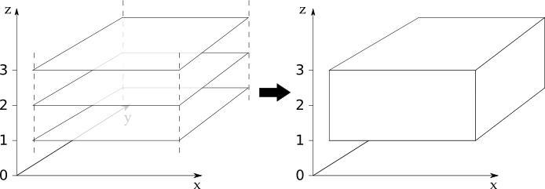

.. _merge_and_concat:

=====================
Merge and Concatenate
=====================

We saw in the :doc:`loading_iris_cubes` chapter that Iris tries to load as few cubes as
possible. This is done by collecting together multiple fields with a shared standard
name (and other key metadata) into a single multidimensional cube. The processes that
perform this behaviour in Iris are known as ``merge`` and ``concatenate``.

This chapter describes the ``merge`` and ``concatenate`` processes; it explains
why common issues occur when using them and gives advice on how prevent these
issues from occurring.

Both ``merge`` and ``concatenate`` take multiple cubes as input and
result in fewer cubes as output. The following diagram illustrates the two processes:

.. image:: merge_and_concat.png
   :alt: Pictographic of merge and concatenation.
   :align: center

There is one major difference between the ``merge`` and ``concatenate`` processes.

 * The ``merge`` process combines multiple input cubes into a
   single resultant cube with new dimensions created from the
   *scalar coordinate values* of the input cubes.

 * The ``concatenate`` process combines multiple input cubes into a
   single resultant cube with the same *number of dimensions* as the input cubes,
   but with the length of one or more dimensions extended by *joining together
   sequential dimension coordinates*.

Let's imagine 28 individual cubes representing the
temperature at a location ``(y, x)``; one cube for each day of February. We can use
:meth:`~iris.cube.CubeList.merge` to combine the 28 ``(y, x)`` cubes into
a single ``(t, y, x)`` cube, where the length of the ``t`` dimension is 28.

Now imagine 12 individual cubes representing daily temperature at a time and
location ``(t, y, x)``; one cube for each month in the year. We can use
:meth:`~iris.cube.CubeList.concatenate` to combine the 12
``(t, y, x)`` cubes into a single ``(t, y, x)`` cube, where the length
of the ``t`` dimension is now 365.

Merge
-----

We've seen that the ``merge`` process combines multiple input cubes into a
single resultant cube with new dimensions created from the
*scalar coordinate values* of the input cubes.

In order to construct new coordinates for the new dimensions, the ``merge`` process requires input cubes
with scalar coordinates that can be combined together into monotonic sequences.
The order of the input cubes does not affect the ``merge`` process.

The ``merge`` process can produce a cube that has more than one new dimension,
if the scalar coordinate sequences form an orthogonal basis.

.. important::

    The shape, metadata, attributes, coordinates, coordinates metadata, fill value and
    other aspects of the input cubes must be consistent across all of the input cubes.

    The ``merge`` process will fail if these are not consistent. Such failures are
    covered in the :ref:`merge_concat_common_issues` section.

The ``merge`` process can be accessed using two methods. The two methods are
:meth:`~iris.cube.CubeList.merge` and :meth:`~iris.cube.CubeList.merge_cube`,
which are described below.

Using CubeList.merge
====================

The :meth:`CubeList.merge <iris.cube.CubeList.merge>` method operates on a list
of cubes and returns a new :class:`~iris.cube.CubeList` containing the cubes
that have been merged.

.. testsetup:: merge

    import numpy as np
    import iris
    def _xy_cube(z):
        cube = iris.cube.Cube(np.arange(20).reshape(4, 5), 'air_temperature', units='kelvin')
        cube.add_dim_coord(iris.coords.DimCoord(range(4), long_name='y'), 0)
        cube.add_dim_coord(iris.coords.DimCoord(range(5), long_name='x'), 1)
        cube.add_aux_coord(iris.coords.DimCoord(z, long_name='z', units='meters'))
        return cube
    cubes = iris.cube.CubeList([_xy_cube(1), _xy_cube(2), _xy_cube(3)])

Let's have a look at the :meth:`~iris.cube.CubeList.merge` method in operation.
In this example we have a list of three lateral (*x*, *y*) cubes in a
variable called ``cubes``, each with a scalar ``z`` coordinate of
differing value. We can merge these cubes by stacking the scalar ``z`` coordinates to
make a new ``z`` dimension coordinate:

.. doctest:: merge
    :options: +ELLIPSIS, +NORMALIZE_WHITESPACE

    >>> print(cubes)
    0: air_temperature / (kelvin)          (y: 4; x: 5)
    1: air_temperature / (kelvin)          (y: 4; x: 5)
    2: air_temperature / (kelvin)          (y: 4; x: 5)

    >>> print(cubes[0])
    air_temperature / (kelvin)          (y: 4; x: 5)
     ...
        Scalar coordinates:
            z                           1 meters
    >>> print(cubes[1])
    air_temperature / (kelvin)          (y: 4; x: 5)
     ...
        Scalar coordinates:
            z                           2 meters
    >>> print(cubes[2])
    air_temperature / (kelvin)          (y: 4; x: 5)
        Dimension coordinates:
            y                             x     -
            x                             -     x
        Scalar coordinates:
            z                           3 meters

    >>> print(cubes.merge())
    0: air_temperature / (kelvin)          (z: 3; y: 4; x: 5)

The following diagram illustrates what has taken place in this example:

The diagram illustrates that we have three input cubes of identical shape
that stack on the ``z`` dimension.
After merging our three input cubes we get a new :class:`~iris.cube.CubeList` containing
one cube with a new ``z`` coordinate.

Using CubeList.merge_cube
=========================

The :meth:`~iris.cube.CubeList.merge_cube` method guarantees that *exactly one cube will be returned*
as a result of merging the input cubes.
If :meth:`~iris.cube.CubeList.merge_cube` cannot fulfil this guarantee, a descriptive error
will be raised providing details to help diagnose the differences between the input cubes.
In contrast, the :meth:`~iris.cube.CubeList.merge` method makes no check on the number of cubes returned.

To demonstrate the differences between :meth:`~iris.cube.CubeList.merge`
and :meth:`~iris.cube.CubeList.merge_cube`, let's return to our three cubes
from the earlier merge example.

For the purposes of this example a ``Conventions`` attribute has been added to the first
cube's :data:`~iris.cube.Cube.attributes` dictionary.
Remember that the attributes *must* be consistent across all cubes in order to merge
into a single cube:

.. testsetup:: merge_vs_merge_cube

    import numpy as np
    import iris
    def _xy_cube(z):
        cube = iris.cube.Cube(np.arange(20).reshape(4, 5), 'air_temperature', units='kelvin')
        cube.add_dim_coord(iris.coords.DimCoord(range(4), long_name='y'), 0)
        cube.add_dim_coord(iris.coords.DimCoord(range(5), long_name='x'), 1)
        cube.add_aux_coord(iris.coords.DimCoord(z, long_name='z', units='meters'))
        return cube
    cubes = iris.cube.CubeList([_xy_cube(1), _xy_cube(2), _xy_cube(3)])
    cubes[0].attributes['Conventions'] = 'CF-1.5'

.. doctest:: merge_vs_merge_cube
    :options: +ELLIPSIS, +NORMALIZE_WHITESPACE

    >>> print(cubes)
    0: air_temperature / (kelvin)          (y: 4; x: 5)
    1: air_temperature / (kelvin)          (y: 4; x: 5)
    2: air_temperature / (kelvin)          (y: 4; x: 5)

    >>> print(cubes[0].attributes)
    {'Conventions': 'CF-1.5'}
    >>> print(cubes[1].attributes)
    {}
    >>> print(cubes[2].attributes)
    {}

    >>> print(cubes.merge())
    0: air_temperature / (kelvin)          (y: 4; x: 5)
    1: air_temperature / (kelvin)          (z: 2; y: 4; x: 5)

    >>> print(cubes.merge_cube())
    Traceback (most recent call last):
        ...
        raise iris.exceptions.MergeError(msgs)
    iris.exceptions.MergeError: failed to merge into a single cube.
      cube.attributes keys differ: 'Conventions'

Note that :meth:`~iris.cube.CubeList.merge` returns two cubes here.
All the cubes that can be merged have been merged. Any cubes that can't be merged are
included unchanged in the returned :class:`~iris.cube.CubeList`.
When :meth:`~iris.cube.CubeList.merge_cube` is called on ``cubes`` it raises a
descriptive error that highlights the difference in the ``attributes`` dictionaries.
It is this difference that is preventing ``cubes`` being merged into a
single cube. An example of fixing an issue like this can be found in the
:ref:`merge_concat_common_issues` section.

Merge in Iris Load
==================

The CubeList's :meth:`~iris.cube.CubeList.merge` method is used internally
by the three main Iris load functions introduced in :doc:`loading_iris_cubes`.
For file formats such as GRIB and PP, which store fields as many
individual 2D arrays, Iris loading uses the ``merge`` process to produce a
more intuitive higher dimensional cube of each phenomenon where possible.

Sometimes the ``merge`` process doesn't behave as expected. In almost all
cases this is due to the input cubes containing unexpected or inconsistent metadata.
For this reason, a fourth Iris file loading function, :func:`iris.load_raw`, exists.
The :func:`~iris.load_raw` function is intended as a diagnostic tool that can be used to
load cubes from files without the ``merge`` process taking place. The return value of
:func:`iris.load_raw` is always a :class:`~iris.cube.CubeList` instance.
You can then call the :meth:`~iris.cube.CubeList.merge_cube` method on this returned
:class:`~iris.cube.CubeList` to help identify merge related load issues.

Concatenate
-----------

We've seen that the ``concatenate`` process combines multiple input cubes into a
single resultant cube with the same *number of dimensions* as the input cubes,
but with the length of one or more dimensions extended by *joining together
sequential dimension coordinates*.

In order to extend the dimensions lengths, the ``concatenate`` process requires input cubes
with dimension coordinates that can be combined together into monotonic sequences.
The order of the input cubes does not affect the ``concatenate`` process.

.. important::

    The shape, metadata, attributes, coordinates, coordinates metadata, fill value and
    other aspects of the input cubes must be consistent across all of the input cubes.

    The ``concatenate`` process will fail if these are not consistent. Such failures are
    covered in the :ref:`merge_concat_common_issues` section.

The ``concatenate`` process can be accessed using two methods. The two methods are
:meth:`~iris.cube.CubeList.concatenate` and :meth:`~iris.cube.CubeList.concatenate_cube`,
which are described below.

Using CubeList.concatenate
==========================

The :meth:`CubeList.concatenate <iris.cube.CubeList.concatenate>` method operates on a list
of cubes and returns a new :class:`~iris.cube.CubeList` containing the cubes
that have been concatenated.

Let's have a look at the :meth:`~iris.cube.CubeList.concatenate` method in operation.
In the example below we have three 3D ``(t, y, x)`` cubes whose ``t`` coordinates
have sequentially increasing ranges.
These cubes can be concatenated by combining the ``t`` coordinates of the input
cubes to form a new cube with an extended ``t`` coordinate:

.. testsetup:: concatenate

    import numpy as np
    import iris
    def _xyt_cube(t):
        cube = iris.cube.Cube(np.arange(12 * len(t)).reshape(-1, 3, 4), 'air_temperature', units='kelvin')
        cube.add_dim_coord(iris.coords.DimCoord(range(3), long_name='y'), 1)
        cube.add_dim_coord(iris.coords.DimCoord(range(4), long_name='x'), 2)
        cube.add_dim_coord(iris.coords.DimCoord(t, long_name='t'), 0)
        return cube
    cubes = iris.cube.CubeList([_xyt_cube(np.arange(31)), _xyt_cube(np.arange(28) + 31), _xyt_cube(np.arange(31) + 59)])

.. doctest:: concatenate
    :options: +ELLIPSIS, +NORMALIZE_WHITESPACE

    >>> print(cubes)
    0: air_temperature / (kelvin)          (t: 31; y: 3; x: 4)
    1: air_temperature / (kelvin)          (t: 28; y: 3; x: 4)
    2: air_temperature / (kelvin)          (t: 31; y: 3; x: 4)

    >>> print(cubes.concatenate())
    0: air_temperature / (kelvin)          (t: 90; y: 3; x: 4)

The following diagram illustrates what has taken place in this example:

.. image:: concat.png
   :alt: Pictographic of concatenate.
   :align: center

The diagram illustrates that we have three 3D input cubes
that line up on the ``t`` dimension.
After concatenating our three input cubes we get a new :class:`~iris.cube.CubeList`
containing one cube with an extended ``t`` coordinate.

Using CubeList.concatenate_cube
===============================

The :meth:`~iris.cube.CubeList.concatenate_cube` method guarantees that *exactly one
cube will be returned* as a result of concatenating the input cubes.
If :meth:`~iris.cube.CubeList.concatenate_cube` cannot fulfil this guarantee, a descriptive error
will be raised providing details to help diagnose the differences between the input cubes.
In contrast, the :meth:`~iris.cube.CubeList.concatenate` method makes no check on the number
of cubes returned.

To demonstrate the differences between :meth:`~iris.cube.CubeList.concatenate`
and :meth:`~iris.cube.CubeList.concatenate_cube`, let's return to our three cubes
from the earlier concatenate example.

For the purposes of this example we'll add a *History* attribute to the first
cube's :data:`~iris.cube.Cube.attributes` dictionary.
Remember that the attributes *must* be consistent across all cubes in order to
concatenate into a single cube:

.. testsetup:: concatenate_vs_concatenate_cube

    import numpy as np
    import iris
    def _xyt_cube(t):
        cube = iris.cube.Cube(np.arange(12 * len(t)).reshape(-1, 3, 4), 'air_temperature', units='kelvin')
        cube.add_dim_coord(iris.coords.DimCoord(range(3), long_name='y'), 1)
        cube.add_dim_coord(iris.coords.DimCoord(range(4), long_name='x'), 2)
        cube.add_dim_coord(iris.coords.DimCoord(t, long_name='t'), 0)
        return cube
    cubes = iris.cube.CubeList([_xyt_cube(np.arange(31)), _xyt_cube(np.arange(28) + 31), _xyt_cube(np.arange(31) + 59)])
    cubes[0].attributes['History'] = 'Created 2010-06-30'

.. doctest:: concatenate_vs_concatenate_cube
    :options: +ELLIPSIS, +NORMALIZE_WHITESPACE

    >>> print(cubes)
    0: air_temperature / (kelvin)          (t: 31; y: 3; x: 4)
    1: air_temperature / (kelvin)          (t: 28; y: 3; x: 4)
    2: air_temperature / (kelvin)          (t: 31; y: 3; x: 4)

    >>> print(cubes[0].attributes)
    {'History': 'Created 2010-06-30'}
    >>> print(cubes[1].attributes)
    {}

    >>> print(cubes.concatenate())
    0: air_temperature / (kelvin)          (t: 31; y: 3; x: 4)
    1: air_temperature / (kelvin)          (t: 59; y: 3; x: 4)
    >>> print(cubes.concatenate_cube())
    Traceback (most recent call last):
        ...
        raise iris.exceptions.ConcatenateError(msgs)
    iris.exceptions.ConcatenateError: failed to concatenate into a single cube.
      Cube metadata differs for phenomenon: air_temperature

Note that :meth:`~iris.cube.CubeList.concatenate` returns two cubes here.
All the cubes that can be concatenated have been concatenated. Any cubes that can't be concatenated are
included unchanged in the returned :class:`~iris.cube.CubeList`.
When :meth:`~iris.cube.CubeList.concatenate_cube` is called on ``cubes`` it raises a
descriptive error that highlights the difference in the ``attributes`` dictionaries.
It is this difference that is preventing ``cubes`` being concatenated into a
single cube. An example of fixing an issue like this can be found in the
:ref:`merge_concat_common_issues` section.

.. _merge_concat_common_issues:

Common Issues With Merge and Concatenate
----------------------------------------

The Iris algorithms that drive :meth:`~iris.cube.CubeList.merge` and
:meth:`~iris.cube.CubeList.concatenate` are complex and depend
on a number of different elements of the input cubes being consistent across
all input cubes.
If this consistency is not maintained then the
:meth:`~iris.cube.CubeList.merge` or
:meth:`~iris.cube.CubeList.concatenate` process can fail in a
seemingly arbitrary manner.

The methods :meth:`~iris.cube.CubeList.merge_cube` and
:meth:`~iris.cube.CubeList.concatenate_cube`
were introduced to Iris to help you locate differences in input cubes
that prevent the input cubes merging or concatenating.
Nevertheless, certain difficulties with using
:meth:`~iris.cube.CubeList.merge` and
:meth:`~iris.cube.CubeList.concatenate` occur frequently.
This section describes these common difficulties, why they arise and
what you can do to avoid them.

Merge
=====

.. _merge_issues_attrs_mismatch:

**Attributes Mismatch**

Differences in the :data:`~iris.cube.Cube.attributes` the input cubes probably
cause the greatest amount of merge-related difficulties.
In recognition of this, Iris has a helper function,
:func:`~iris.util.equalise_attributes`, to equalise
attributes differences in the input cubes.

.. note::

    The functionality provided by :func:`iris.util.describe_diff` and
    :meth:`iris.cube.Cube.is_compatible` are **not** designed to give user
    indication of whether two cubes can be merged.

To demonstrate using :func:`~iris.util.equalise_attributes`,
let's return to our non-merging list of input cubes from the merge_cube example
from earlier.
We'll call :func:`~iris.util.equalise_attributes` on the
input cubes before merging the input cubes using :meth:`~iris.cube.CubeList.merge_cube`:

.. doctest:: merge_vs_merge_cube
    :options: +ELLIPSIS, +NORMALIZE_WHITESPACE

    >>> from iris.util import equalise_attributes
    >>> print(cubes)
    0: air_temperature / (kelvin)          (y: 4; x: 5)
    1: air_temperature / (kelvin)          (y: 4; x: 5)
    2: air_temperature / (kelvin)          (y: 4; x: 5)

    >>> print(cubes[0].attributes)
    {'Conventions': 'CF-1.5'}
    >>> print(cubes[1].attributes)
    {}
    >>> print(cubes[2].attributes)
    {}

    >>> print(cubes.merge_cube())
    Traceback (most recent call last):
        ...
        raise iris.exceptions.MergeError(msgs)
    iris.exceptions.MergeError: failed to merge into a single cube.
      cube.attributes keys differ: 'Conventions'

    >>> removed_attributes = equalise_attributes(cubes)

    >>> print(cubes[0].attributes)
    {}

    >>> print(cubes.merge_cube())
    air_temperature / (kelvin)          (z: 3; y: 4; x: 5)
         Dimension coordinates:
              z                           x     -     -
              y                           -     x     -
              x                           -     -     x

**Incomplete Data**

Merging input cubes with inconsistent dimension lengths can cause misleading results.
This is a common problem when merging cubes generated by different ensemble members in a model run.

The misleading results cause the merged cube to gain an anonymous leading dimension.
All the merged coordinates appear as auxiliary coordinates on the anonymous leading dimension.
This is shown in the example below::

    >>> print(cube)
    surface_temperature / (K)           (-- : 5494; latitude: 325; longitude: 432)
         Dimension coordinates:
              latitude                      -               x               -
              longitude                     -               -               x
         Auxiliary coordinates:
              forecast_month                x               -               -
              forecast_period               x               -               -
              forecast_reference_time       x               -               -
              realization                   x               -               -
              time                          x               -               -

**Merging Duplicate Cubes**

The Iris merge process does not merge duplicate cubes (two or more identical cubes in
the input cubes) by default.
This behaviour can be changed by setting the ``unique`` keyword argument
to :meth:`~iris.cube.CubeList.merge` to ``False``.

Merging duplicate cubes can cause misleading results. Let's demonstrate these
behaviours and misleading results with the following example.
In this example we have three input cubes.
The first has a scalar ``z`` coordinate with value 1, the second has a
scalar ``z`` coordinate with value 2 and the third has a scalar ``z``
coordinate with value 1.
The first and third cubes are thus identical.
We will demonstrate the effect of merging the input cubes with ``unique=False``
(duplicate cubes allowed) and ``unique=True`` (duplicate cubes not allowed, which
is the default behaviour):

.. testsetup:: merge_duplicate

    import numpy as np
    import iris
    def _xy_cube(z):
        cube = iris.cube.Cube(np.arange(20).reshape(4, 5), 'air_temperature', units='kelvin')
        cube.add_dim_coord(iris.coords.DimCoord(range(4), long_name='y'), 0)
        cube.add_dim_coord(iris.coords.DimCoord(range(5), long_name='x'), 1)
        cube.add_aux_coord(iris.coords.DimCoord(z, long_name='z', units='meters'))
        return cube
    cubes = iris.cube.CubeList([_xy_cube(1), _xy_cube(2), _xy_cube(1)])

.. doctest:: merge_duplicate
    :options: +ELLIPSIS, +NORMALIZE_WHITESPACE

    >>> print(cubes)
    0: air_temperature / (kelvin)          (y: 4; x: 5)
    1: air_temperature / (kelvin)          (y: 4; x: 5)
    2: air_temperature / (kelvin)          (y: 4; x: 5)

    >>> print(cubes.merge(unique=False))
    0: air_temperature / (kelvin)          (z: 2; y: 4; x: 5)
    1: air_temperature / (kelvin)          (z: 2; y: 4; x: 5)

    >>> print(cubes.merge())  # unique=True is the default.
    Traceback (most recent call last):
      ...
    iris.exceptions.DuplicateDataError: failed to merge into a single cube.
      Duplicate 'air_temperature' cube, with scalar coordinates z=Cell(point=1, bound=None)

Notice how merging the input cubes with duplicate cubes allowed produces a result
with **four** `z` coordinate values.
Closer inspection of these two resultant cubes demonstrates that the
scalar ``z`` coordinate with value 2 is found in both cubes.

Trying to merge the input cubes with duplicate cubes not allowed raises an
error highlighting the presence of the duplicate cube.

**Single Value Coordinates**

Coordinates containing only a single value can cause confusion when
combining input cubes. Remember:

* The ``merge`` process combines multiple input cubes into a
  single resultant cube with new dimensions created from the
  **scalar** *coordinate values* of the input cubes.
* The ``concatenate`` process combines multiple input cubes into a
  single resultant cube with the same *number of dimensions* as the input cubes,
  but with the length of one or more dimensions extended by *joining together
  sequential* **dimension** *coordinates*.

In Iris terminology a **scalar** coordinate is a
coordinate of length 1 *which does not describe a data dimension*.

Let's look at two example cubes to demonstrate this.

If your cubes are similar to those below (the single value ``z`` coordinate
is not on a dimension) then use :meth:`~iris.cube.CubeList.merge` to
combine your cubes::

    >>> print(cubes[0])
    air_temperature / (kelvin)          (y: 4; x: 5)
        Dimension coordinates:
            y                             x     -
            x                             -     x
        Scalar coordinates:
            z                           1 meters
    >>> print(cubes[1])
    air_temperature / (kelvin)          (y: 4; x: 5)
        Dimension coordinates:
            y                             x     -
            x                             -     x
        Scalar coordinates:
            z                           2 meters

If your cubes are similar to those below (the single value ``z`` coordinate is
associated with a dimension) then use :meth:`~iris.cube.CubeList.concatenate` to
combine your cubes::

    >>> print(cubes)
    0: air_temperature / (kelvin)          (z: 1; y: 4; x: 5)
    1: air_temperature / (kelvin)          (z: 1; y: 4; x: 5)

Concatenate
===========

**Time Units**

Differences in the units of the time coordinates of the input cubes probably cause
the greatest amount of concatenate-related difficulties.
In recognition of this, Iris has a helper function,
:func:`~iris.util.unify_time_units`, to apply a common time unit to all the input cubes.

To demonstrate using :func:`~iris.util.unify_time_units`,
let's adapt our list of input cubes from the ``concatenate_cube`` example from earlier.
We'll give the input cubes unequal time coordinate units and call
:func:`~iris.util.unify_time_units` on the input cubes before concatenating
the input cubes using :meth:`~iris.cube.CubeList.concatenate_cube`:

.. testsetup:: concatenate_time_units

    import numpy as np
    import iris
    def _xyt_cube(t):
        cube = iris.cube.Cube(np.arange(12 * len(t)).reshape(-1, 3, 4), 'air_temperature', units='kelvin')
        cube.add_dim_coord(iris.coords.DimCoord(range(3), long_name='y'), 1)
        cube.add_dim_coord(iris.coords.DimCoord(range(4), long_name='x'), 2)
        cube.add_dim_coord(iris.coords.DimCoord(t, long_name='t'), 0)
        return cube
    cubes = iris.cube.CubeList([_xyt_cube(np.arange(31).astype(np.float64)),
                                _xyt_cube(np.arange(28).astype(np.float64) + 31),
                                _xyt_cube(np.arange(31).astype(np.float64) + 59)])
    cubes[0].coord('t').units = 'days since 1990-02-15'
    cubes[1].coord('t').units = 'days since 1970-01-01'
    cubes[2].coord('t').units = 'days since 1970-01-01'

.. doctest:: concatenate_time_units
    :options: +ELLIPSIS, +NORMALIZE_WHITESPACE

    >>> from iris.util import unify_time_units
    >>> print(cubes)
    0: air_temperature / (kelvin)          (t: 31; y: 3; x: 4)
    1: air_temperature / (kelvin)          (t: 28; y: 3; x: 4)
    2: air_temperature / (kelvin)          (t: 31; y: 3; x: 4)

    >>> print(cubes[0].coord('t').units)
    days since 1990-02-15
    >>> print(cubes[1].coord('t').units)
    days since 1970-01-01

    >>> print(cubes.concatenate_cube())
    Traceback (most recent call last):
     ...
    ConcatenateError: failed to concatenate into a single cube.
      Dimension coordinates metadata differ: t != t

    >>> unify_time_units(cubes)

    >>> print(cubes[1].coord('t').units)
    days since 1990-02-15

    >>> print(cubes.concatenate_cube())
    air_temperature / (kelvin)          (t: 90; y: 3; x: 4)
         Dimension coordinates:
              t                           x      -     -
              y                           -      x     -
              x                           -      -     x

**Attributes Mismatch**

The ``concatenate`` process is affected by attributes mismatch on input cubes
in the same way that the ``merge`` process is.
The :ref:`Attributes Mismatch <merge_issues_attrs_mismatch>` section earlier in this
chapter gives further information on attributes mismatch.
